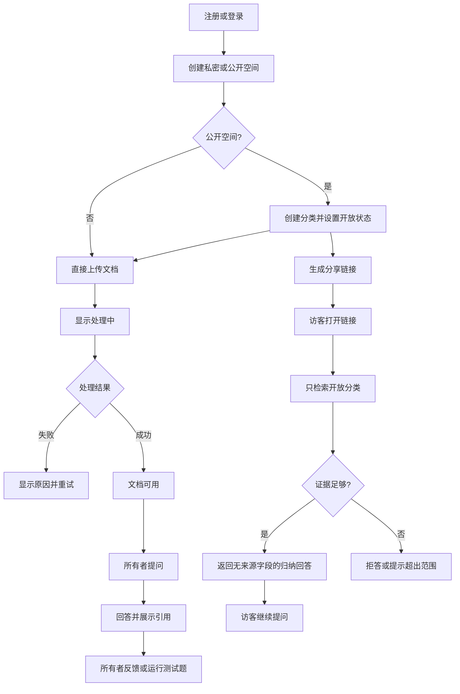

# 私有知识库 RAG MVP 第一版方案

> 版本：MVP v0.1  
> 编制日期：2026-09-09  
> 需求依据：[需求分析文档](./需求分析文档.md)  
> 技术依据：[技术方案](./技术方案.md)  
> 固定技术：FastAPI + Taro H5  
> 目标终端：桌面浏览器与移动浏览器

## 1. 现有方案检查结论

现有技术方案总体可行，能够覆盖需求中的私密空间、公开分类、分享访问、异步文档处理、带引用问答、访客范围控制、拒答、反馈和轻量评测。

第一版实施时需要做以下收敛和补充：

1. 现有技术方案是一份完整架构参考，内容较广；开发第一版时需要把能力拆成严格的 P0 清单，避免同时实现高级缓存、复杂索引调优和完整可观测平台。
2. 需求核对清单要求用户能够删除问答记录，原 API 规划没有明确的对话删除接口，第一版需要补充。
3. 模型供应商和 Embedding 模型尚未确定，因此向量维度、调用协议、阈值和费用上限暂时不能写死；但可以先按适配器接口开发。
4. 桌面端和移动端均为网页，Taro 应只构建 H5；不需要小程序、React Native、Electron 或 Tauri。
5. 移动浏览器和微信内置浏览器的流式读取能力可能不同，必须保留普通 JSON 回答降级路径，不能把 SSE 作为唯一问答方式。
6. 第一版数据规模较小，不把 HNSW 参数调优、reranker、混合搜索和语义缓存作为发布前置条件；先保证权限正确、引用可信和拒答可验证。
7. 当前后端使用 Python 3.14，正式开发前必须完成文档解析、Celery、数据库驱动和模型 SDK 的兼容性冒烟测试。
8. 权限泄漏是发布阻断问题：跨用户、跨空间、关闭分类、已撤销链接和已删除文档的测试结果必须全部为零泄漏。

## 2. 第一版产品定义

### 2.1 一句话目标

> 用户可以在桌面或手机网页中创建私密/公开知识空间、上传文档并提问；所有者能看到可靠来源，访客只能围绕已开放分类获得归纳回答；没有证据时系统明确拒答。

### 2.2 第一版要证明的价值

第一版只需要证明四件事：

1. 文档能够稳定转化为可查询知识；
2. 回答能够追溯到真实文档片段；
3. 公开访问不会检索私密空间和关闭分类；
4. 系统能够识别没有证据的问题并拒答。

反馈和轻量评测用于证明以上能力可以被重复验证，而不是只展示一次理想回答。

### 2.3 第一版用户角色

仅包含两种角色：

| 角色 | 权限 |
| --- | --- |
| 空间所有者 | 创建和管理空间、分类、文档、分享链接、问答、引用、反馈和测试题 |
| 分享链接访客 | 进入公开空间、围绕当前开放分类提问、查看回答；默认不能反馈 |

第一版不实现团队成员、管理员、编辑者、组织和复杂角色权限。

## 3. P0 功能范围

### 3.1 注册与登录

- 邮箱和密码注册；
- 邮箱和密码登录；
- 自动刷新登录状态；
- 主动退出；
- 未登录用户不能访问所有者页面；
- 第一版不做短信、微信、SSO 和找回密码流程。

### 3.2 知识空间

- 创建私密空间或公开空间；
- 编辑空间名称和描述；
- 查看空间列表和资料数量；
- 切换空间；
- 删除空间；
- 私密空间只允许所有者访问；
- 公开空间在生成分享链接前仍不可被访客访问。

### 3.3 公开分类

- 只有公开空间可以创建分类；
- 创建、编辑和删除分类；
- 独立设置分类开放或关闭；
- 公开空间中的文档必须归属一个分类；
- 分类关闭后，新访客问题不能检索该分类；
- 第一版不做分类排序、标签和层级分类。

### 3.4 分享链接

- 每个公开空间第一版最多保留一个活动分享链接；
- 生成并复制分享链接；
- 撤销分享链接；
- 撤销后现有访客会话立即失效；
- 原始分享令牌只在生成时返回，数据库只保存哈希；
- 第一版不做密码、有效期、访问次数配置和多个并行链接。

### 3.5 文档上传与管理

- 支持 PDF、DOCX、Markdown、TXT；
- 支持单个和多个文件选择；
- 前端默认最多同时上传 3 个文件；
- 公开空间上传时必须选择分类；
- 展示文件名、大小、上传时间和处理状态；
- 用户可看到处理中、可用和失败；
- 失败时显示可理解的原因并支持重新处理；
- 所有者可以查看文档基本信息和下载原文件；
- 删除文档后立即退出新的检索结果；
- 扫描 PDF、图片和复杂表格不属于第一版。

### 3.6 所有者问答

- 在当前空间创建对话；
- 支持单轮提问和连续追问；
- 只检索当前空间中状态为可用的文档；
- 返回回答状态；
- 有答案时展示文件名、页码或段落位置、原文片段；
- 资料不足时明确提示；
- 资料冲突时提示存在冲突；
- 可以删除自己的对话记录。

### 3.7 访客问答

- 访客通过分享链接进入公开问答页；
- 页面展示空间名称、描述、开放分类和范围提示；
- 每次问题都重新校验链接及当前开放分类；
- 只检索开放分类中的可用文档；
- 响应中不包含文件名、页码、原文片段、下载地址和内部引用 ID；
- 超出公开范围或证据不足时明确提示；
- 拒绝批量恢复、逐字输出或枚举原文的请求；
- 第一版默认关闭访客反馈。

### 3.8 回答反馈

- 所有者可以标记有用、无用、需要修正；
- 可以选择答非所问、来源不匹配、信息过期、回答不完整、资料缺失；
- 可以填写补充说明；
- 公开空间可以设置是否允许访客反馈；
- 反馈与具体消息关联。

### 3.9 轻量质量自测

- 所有者可以手动录入 10～20 个测试问题；
- 标记问题属于私密空间、公开分类或跨范围问题；
- 执行测试时复用正式问答流程；
- 查看回答和内部引用；
- 人工标记正确、部分正确或错误；
- 汇总正确数、有效引用数、无答案数和越权回答数；
- 保存本次知识库版本、模型和检索参数快照；
- 第一版不接入完整 Ragas 自动评测。

### 3.10 数据说明与删除

- 展示资料用途、保存范围和删除方式；
- 可以删除文档、对话和知识空间；
- 可以撤销分享链接；
- 删除空间时同步禁止访问，再异步清理对象文件和向量；
- 不宣称第一版已满足全部企业合规要求。

## 4. 第一版明确不做

- 团队邀请、组织、成员角色和 SSO；
- 支付、套餐、额度购买和发票；
- 网页、网盘、飞书、钉钉、Notion 等数据同步；
- OCR、图片、音频、视频和复杂表格理解；
- Agent、工作流和工具调用；
- 对外开放 API 和嵌入式组件；
- 自动生成测试题和完整自动评测平台；
- reranker、Elasticsearch、独立向量数据库；
- 跨用户或跨空间语义缓存；
- 小程序、原生 App 和桌面安装包；
- 企业私有化交付和完整合规认证。

## 5. 核心用户流程



## 6. 第一版技术基线

```text
Taro H5 + React + TypeScript
        ↓ HTTPS / REST / 可选 SSE
FastAPI 模块化单体
        ├── PostgreSQL + pgvector
        ├── Redis + Celery Worker
        ├── MinIO/S3 兼容对象存储
        └── LLM / Embedding 适配器
```

### 6.1 保留的基础设施

| 组件 | 第一版是否保留 | 原因 |
| --- | --- | --- |
| PostgreSQL | 是 | 业务数据和事务 |
| pgvector | 是 | 在 SQL 权限过滤下完成向量检索 |
| Redis | 是 | Celery Broker 和访客限流 |
| Celery Worker | 是 | 文档解析和 Embedding 不能阻塞 API |
| MinIO | 是 | 开发环境模拟私有对象存储 |
| Nginx/Caddy | 部署时保留 | HTTPS、反向代理和 H5 路由回退 |

Windows 开发环境统一通过 Docker Compose 运行数据库、Redis、MinIO 和 Worker，避免本机运行环境差异进入业务代码。

### 6.2 第一版暂缓的技术增强

- 不做微服务拆分；
- 不做 Kubernetes；
- 不把 HNSW 参数调优作为开发主线；
- 不做 reranker；
- 不做混合检索；
- 不做分布式追踪平台；
- 不做答案语义缓存；
- 不做模型自动切换和多模型路由。

## 7. 第一版页面

| 页面 | 桌面端 | 移动端 |
| --- | --- | --- |
| 登录 | 居中表单 | 全宽表单 |
| 空间列表 | 卡片网格 | 单列卡片 |
| 空间详情 | 左侧导航 + 主内容 | 顶部导航 + 单列内容 |
| 分类管理 | 表格/列表 | 卡片列表 |
| 文档管理 | 表格 + 上传区域 | 卡片 + 文件选择按钮 |
| 所有者问答 | 对话区 + 右侧引用面板 | 对话区 + 引用底部抽屉 |
| 访客问答 | 居中单栏 | 全屏单栏 |
| 反馈记录 | 表格和筛选 | 卡片列表 |
| 质量自测 | 测试表格 | 测试卡片 |

响应式基线：

- `< 768px` 使用移动端单栏；
- `768px～1199px` 使用可折叠两栏；
- `>= 1200px` 使用桌面多栏；
- 表格在移动端转换为卡片；
- 所有核心操作不依赖鼠标悬停；
- 问答流不支持时自动使用普通 JSON 响应。

## 8. 最小数据表

第一版保留以下表：

```text
users
refresh_tokens
knowledge_spaces
categories
share_links
documents
document_versions
document_jobs
chunks
conversations
messages
citations
feedback
eval_cases
eval_runs
eval_results
```

关键字段和约束沿用《技术方案》，第一版必须落实以下数据库约束：

1. `knowledge_spaces.owner_user_id` 不能为空；
2. `categories.space_id` 必须指向公开空间；
3. 公开空间文档必须有 `category_id`；
4. 文档和分类必须属于同一空间；
5. 只有活动文档版本的 chunk 可以被检索；
6. `share_links.token_hash` 唯一；
7. 对话固定绑定空间和访问身份；
8. 引用只能指向本次回答实际召回的 chunk；
9. 所有表保存 UTC 时间；
10. 删除状态必须在向量检索条件中显式排除。

## 9. 最小 API

### 9.1 认证

```text
POST   /api/v1/auth/register
POST   /api/v1/auth/login
POST   /api/v1/auth/refresh
POST   /api/v1/auth/logout
GET    /api/v1/auth/me
```

### 9.2 空间和分类

```text
GET    /api/v1/spaces
POST   /api/v1/spaces
GET    /api/v1/spaces/{space_id}
PATCH  /api/v1/spaces/{space_id}
DELETE /api/v1/spaces/{space_id}

GET    /api/v1/spaces/{space_id}/categories
POST   /api/v1/spaces/{space_id}/categories
PATCH  /api/v1/categories/{category_id}
DELETE /api/v1/categories/{category_id}
```

### 9.3 分享

```text
POST   /api/v1/spaces/{space_id}/share-link
DELETE /api/v1/spaces/{space_id}/share-link
POST   /api/v1/public/session
GET    /api/v1/public/space
```

### 9.4 文档

```text
POST   /api/v1/spaces/{space_id}/documents
GET    /api/v1/spaces/{space_id}/documents
GET    /api/v1/documents/{document_id}
GET    /api/v1/documents/{document_id}/download
POST   /api/v1/documents/{document_id}/retry
DELETE /api/v1/documents/{document_id}
```

### 9.5 问答与历史

```text
POST   /api/v1/owner/conversations
GET    /api/v1/owner/conversations/{conversation_id}
POST   /api/v1/owner/conversations/{conversation_id}/messages
DELETE /api/v1/owner/conversations/{conversation_id}

POST   /api/v1/public/conversations
POST   /api/v1/public/conversations/{conversation_id}/messages
```

消息接口支持：

- `stream=true`：SSE；
- `stream=false`：普通 JSON；
- 两种模式使用相同的访问控制、检索和回答逻辑。

### 9.6 反馈和评测

```text
POST   /api/v1/messages/{message_id}/feedback
GET    /api/v1/spaces/{space_id}/feedback

GET    /api/v1/spaces/{space_id}/eval-cases
POST   /api/v1/spaces/{space_id}/eval-cases
PATCH  /api/v1/eval-cases/{case_id}
DELETE /api/v1/eval-cases/{case_id}
POST   /api/v1/spaces/{space_id}/eval-runs
GET    /api/v1/eval-runs/{run_id}
PATCH  /api/v1/eval-results/{result_id}
```

## 10. 文档入库第一版

```text
上传
→ 服务端检查扩展名、MIME、大小和文件哈希
→ 写入私有对象存储
→ documents.status = PROCESSING
→ Celery 解析文本
→ 按标题、段落和页切块
→ 批量生成 Embedding
→ 写入 document_version 和 chunks
→ 事务内切换 active_version
→ documents.status = READY
```

建议初始参数：

- 单文件上限：20MB，可通过配置调整；
- 上传并发：每个用户 3 个；
- chunk 大小：400～700 tokens；
- overlap：80～120 tokens；
- 向量召回：Top 12；
- 最终上下文：去重后 4～6 个片段；
- Worker 同一时间处理的文档数量通过环境变量限制。

处理失败必须映射为用户可理解的错误：

- 文件损坏；
- PDF 加密；
- 扫描 PDF 无文本；
- 不支持的类型；
- 文档为空；
- 模型服务超时；
- 系统内部错误。

## 11. RAG 第一版

### 11.1 检索

第一版只做稠密向量检索：

1. 根据登录用户或分享会话构造服务端 `RetrievalScope`；
2. 将当前问题转换为向量；
3. 在 SQL 中按用户、空间、开放分类、文档状态和活动版本过滤；
4. 从过滤后的数据中取得 Top 12；
5. 去重后选择 4～6 个片段作为回答上下文。

数据量小时优先使用可预测的精确检索。HNSW 可以保留在迁移或后续优化中，但不在缺少性能数据时投入时间调参。

### 11.2 连续追问

- 第一轮直接检索；
- 后续问题结合最近对话改写成独立问题；
- 对话历史只帮助理解问题，不能作为新的知识证据；
- 每次追问重新计算权限范围；
- 对话不能切换到另一个空间。

### 11.3 回答状态

```text
ANSWERED
INSUFFICIENT_EVIDENCE
OUT_OF_SCOPE
CONFLICT
FAILED
```

### 11.4 拒答规则

出现以下情况之一时拒答：

- 没有召回片段；
- 最高相关结果低于基于测试集校准的阈值；
- 模型没有为事实选择有效引用；
- 访客问题只能从私密空间或关闭分类得到答案；
- 访客要求输出完整原文、文件列表或内部来源；
- 模型生成内容与检索证据明显不一致。

不得在测试前写死一个看似精确但未经验证的通用相似度阈值。

### 11.5 引用

- 每个候选片段分配内部 ID；
- 模型返回使用的内部 ID；
- 服务端校验 ID 属于本次召回集合；
- 所有者接口映射成文件名、位置和片段；
- 访客接口完全不序列化引用信息；
- 引用校验失败最多重试一次，仍失败则拒答。

## 12. 安全不变量

以下规则必须落实到服务端和自动化测试，不能只写在提示词中：

1. 用户不能读取或修改其他用户的空间；
2. 访客不能访问私密空间；
3. 访客不能检索关闭分类；
4. 客户端提交的空间、分类和公开状态不具备授权效力；
5. 分享链接撤销后所有关联访客会话失效；
6. 文档删除或进入非 READY 状态后不能参与新检索；
7. 访客响应模型没有引用、文件和下载字段；
8. 对象存储默认私有；
9. 日志不记录密码、令牌和完整文档正文；
10. 同一对话不能改变访问身份或空间；
11. 访客问答按分享链接和 IP 限流；
12. Markdown 回答经过安全渲染，不能执行任意 HTML 或脚本。

## 13. 开发顺序

### 里程碑 0：环境可用

预计 2～3 天：

- 整理 `backend`、`frontend` 和 `infra`；
- 初始化 Taro H5；
- 配置 PostgreSQL、pgvector、Redis 和 MinIO；
- 建立 FastAPI 健康检查；
- 建立 Alembic、Ruff、pytest 和前端检查；
- 验证 Python 3.14 与核心依赖；
- 生成第一版 OpenAPI 客户端。

完成标准：一条命令可以启动本地依赖、API 和前端。

### 里程碑 1：权限闭环

预计 4～5 天：

- 注册、登录、刷新和退出；
- 空间 CRUD；
- 公开分类 CRUD 和开关；
- 分享链接生成、访问和撤销；
- 所有者和访客接口分组；
- 权限矩阵集成测试。

完成标准：尚未接入 RAG 时，所有访问边界已经可以自动验证。

### 里程碑 2：文档闭环

预计 5 天：

- 多文件上传；
- 对象存储；
- Celery 任务；
- 四种文档解析；
- 切块和向量化；
- 状态轮询、失败原因、重试和删除；
- 桌面和移动端文档页面。

完成标准：每种文档至少有一个成功样例和一个失败样例。

### 里程碑 3：可信问答闭环

预计 5～6 天：

- 所有者单轮和连续问答；
- 权限过滤后的 pgvector 检索；
- 引用生成和校验；
- 拒答与冲突状态；
- 访客专用回答接口；
- SSE 和普通 JSON；
- 删除对话历史。

完成标准：可以演示正确回答、有效引用、资料不足拒答和访客零越权。

### 里程碑 4：反馈和自测

预计 3～4 天：

- 回答反馈；
- 测试题 CRUD；
- 执行评测；
- 人工标记；
- 统计正确、部分正确、错误、有效引用、无答案和越权；
- 保存运行配置快照。

完成标准：能够完成一次包含 10～20 个问题的可复现测试。

### 里程碑 5：响应式验收和部署

预计 3～4 天：

- 桌面、平板和移动视口调整；
- 微信内置浏览器降级验证；
- Playwright 核心 E2E；
- 日志脱敏、限流和安全响应头；
- Docker 部署；
- 演示数据、README 和演示脚本。

完成标准：新用户能够在桌面或手机网页上独立完成核心流程。

总体预计：单人全职约 5 周，包含少量缺陷修复缓冲。

## 14. 第一版验收场景

### 场景 A：私密空间

```text
Given 用户创建了私密空间并上传可用文档
When 所有者提问文档内的问题
Then 返回有依据的回答、文件名、位置和原文片段
And 未登录用户不能进入该空间
```

### 场景 B：公开分类

```text
Given 公开空间包含开放分类 A 和关闭分类 B
And 两个分类分别含有唯一测试信息
When 访客通过有效分享链接提问分类 A 的问题
Then 可以回答
And 响应中不存在文件名、页码、片段和下载地址
```

### 场景 C：越权问题

```text
Given 答案只存在于私密空间或关闭分类 B
When 访客提问该问题
Then 返回 OUT_OF_SCOPE 或 INSUFFICIENT_EVIDENCE
And 私密 canary 不得出现在回答、日志或错误信息中
```

### 场景 D：资料不足

```text
Given 当前检索范围没有相关资料
When 所有者或访客提问
Then 系统明确说明资料不足
And 记录拒答结果
```

### 场景 E：删除文档

```text
Given 文档已经参与过回答
When 所有者删除该文档
Then 后续问题不能再召回它
And 历史回答仍保留当时的引用快照或显示来源已删除
```

### 场景 F：撤销链接

```text
Given 访客已经通过分享链接建立会话
When 所有者撤销分享链接
Then 原链接和现有访客会话均不能继续提问
```

### 场景 G：响应式网页

```text
Given 桌面和移动浏览器访问同一套 Taro H5
When 用户完成登录、上传、问答和查看引用
Then 核心操作在两种视口均可完成
And 移动端不支持流式读取时自动降级为普通回答
```

### 场景 H：轻量评测

```text
Given 所有者创建了 10～20 个测试问题
When 执行一次评测并完成人工标记
Then 页面汇总正确率、有效引用、无答案和越权结果
And 保存本次模型、知识库和检索配置
```

## 15. 发布阻断条件

出现以下任一情况，不应发布第一版：

- 访客能够召回私密空间或关闭分类；
- 分享链接撤销后仍可继续提问；
- 文档删除后仍会进入新的检索结果；
- 访客接口包含引用或文件字段；
- 所有者显示的引用与实际回答无关；
- 没有资料时仍频繁生成确定性事实；
- PDF、DOCX、MD、TXT 中任一类型没有成功和失败处理路径；
- 桌面端或移动端无法完成完整核心流程；
- 没有可重复运行的 10～20 题测试集；
- 密码、JWT、分享令牌或模型密钥出现在日志中。

## 16. 第一版完成定义

第一版完成需要同时满足：

1. P0 功能全部实现；
2. 所有数据库迁移可从空库执行；
3. 一条命令能够启动开发环境；
4. 后端单元测试和权限集成测试通过；
5. Taro 桌面与移动核心 E2E 通过；
6. 四种文件格式均有测试样例；
7. 越权回答数为 0；
8. 完成一次 10～20 题人工评测；
9. 准备一套个人经历或模拟企业演示资料；
10. README 能指导新环境完成启动和演示；
11. 至少邀请 5 名目标用户试用；
12. 根据反馈形成明确的 P1 排期，而不是直接扩展全部功能。

## 17. 开发前必须确定的参数

总体架构已经确定，但开始“里程碑 2：文档闭环”前需要确定：

1. 默认 LLM 厂商和模型；
2. 默认 Embedding 模型及向量维度；
3. 模型服务是否可以接收用户文档片段；
4. 初始模型调用预算或额度；
5. 生产环境使用的对象存储；
6. 是否确认首版登录只使用邮箱和密码。

这些参数在确认前通过配置和适配器保留，不阻塞环境、空间、分类、分享和权限模块的开发。

