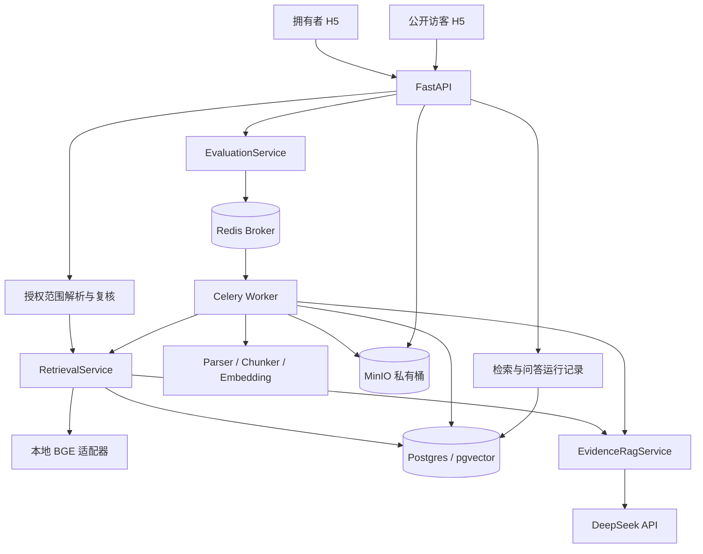
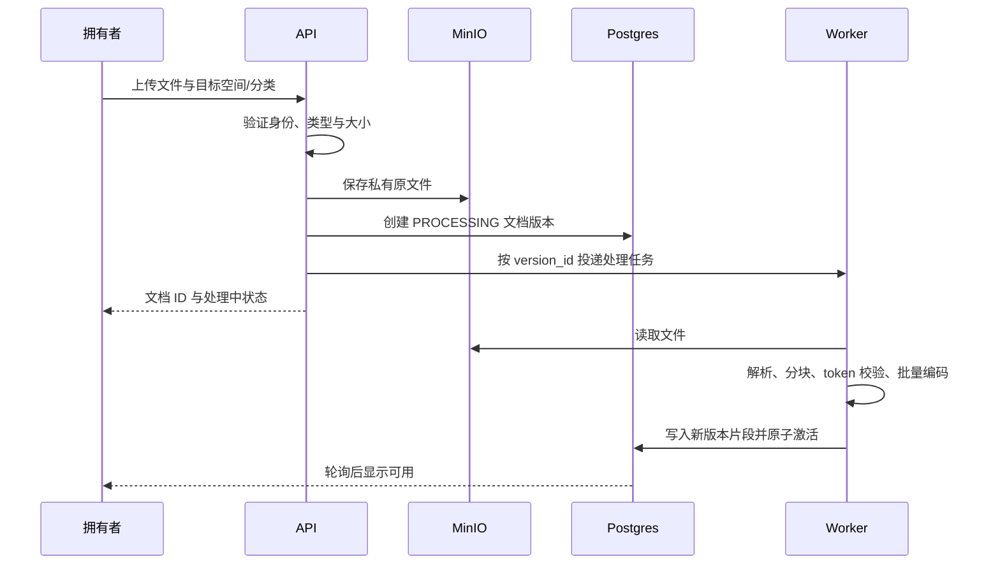
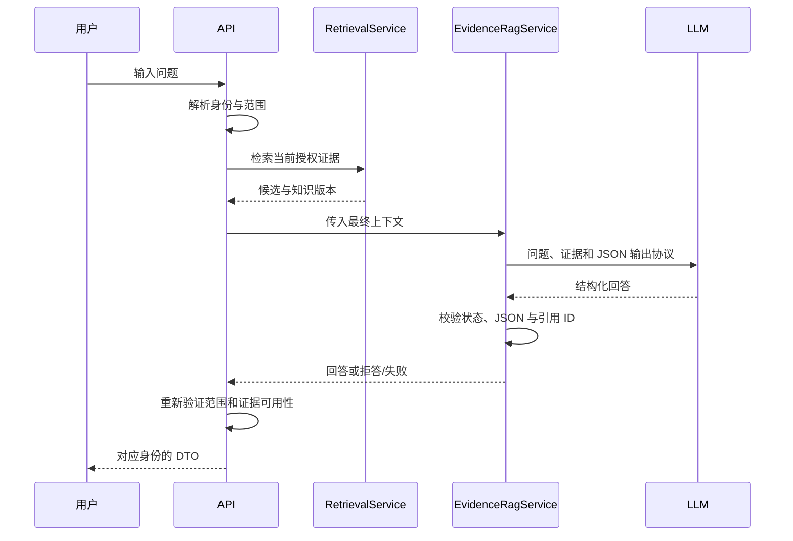

# 知溯 AiKnowledge V2 方案设计文档

> 设计日期：2026-09-30
> 需求依据：`V2需求分析文档.md`，以本次确认的知识库 RAG 场景为准
> 交付性质：技术设计与开发顺序；本轮没有实施功能、执行迁移或部署
> 适用范围：个人简历项目，兼容个人知识工作者、小团队和公开问答访客
> 设计原则：复用 V1；先验证业务闭环，再接入真实基础设施，最后增加有评估收益的优化

## 1. 目标、范围与完成定义

### 1.1 核心业务

```text
资料 → 解析 → 分块 → Embedding → 授权范围内检索
                                    ├─ 拥有者查看 Top K 证据
                                    └─ Prompt → LLM → 回答/拒答
                                                      ↓
                                              反馈 → 修复 → 同题复测
```

本项目不包含 AI 出题、用户答题或学习分析报告。评测题由拥有者维护，用于验证知识库效果。

### 1.2 V2 MVP 范围

| 编号 | 对应需求 | 技术交付 |
| --- | --- | --- |
| M01 | 空间与文档复用 | 补齐操作入口、活动版本和删除清理验收 |
| M02 | 独立检索 | 共用检索服务、Owner 检索 API、Top K 结果面板、手写示例 |
| M03 | 完整问答 | 复用生成器，保存检索证据，明确拒答和故障 |
| M04 | 公开范围 | 统一范围约束、输出前复核、历史与缓存隔离 |
| M05 | 轻量评估 | 证据标注、知识清单快照、召回指标、人工评分和复测 |

MVP 不引入 BM25、混合检索、真实 Reranker、LLM 查询改写、Ragas 自动裁判、OCR、Agent、独立公开稿发布或新付费体系。它们只保留扩展接口。

### 1.3 完成定义

- 拥有者可以上传资料、查看可用状态、测试 Top K、问答并核对引用。
- 公开访客只在当前有效分享范围内获得回答，不能调用证据诊断接口。
- 能用 10—20 题完成首次闭环，正式验收补足 50 题及人工评分。
- 能演示一条失败问题从反馈到资料修复、同题复测的全过程。
- 真实 Postgres、Redis、MinIO、Worker、模型链路有验收证据。
- 权限越界、模型报错、未评分和历史数据缺失被明确记录，不能伪装成成功。

## 2. 现有工程基线与设计假设

### 2.1 本轮检查到的实现

| 组件 | 当前情况 | V2 处理 |
| --- | --- | --- |
| 前端 | Taro 4.2.1、React 18、TypeScript；已有问答、文档和评测 UI | 继续以 H5 为验收入口，局部拆组件 |
| API | FastAPI、Pydantic、SQLAlchemy async、asyncpg | 增补检索服务与接口，不重做认证 |
| 存储 | Postgres + pgvector、MinIO | 复用向量与原文件存储 |
| 任务 | Celery + Redis | 文档继续异步，50 题评测改成可轮询任务 |
| 检索 | pgvector 余弦排序，默认候选 12、最终上下文 4 | 抽出共用授权检索能力 |
| RAG | 手写余弦入口、已排序片段生成入口、引用 JSON 校验 | 保留原理示例与正式持久化链路 |
| 连续问答 | 根据最近用户问题做规则补全 | 原样复用；不新加 LLM 改写 |
| 评测 | 题集快照、运行、人工评分、运行比较 | 补充证据、召回结果和知识版本 |
| 数据表 | 文档版本、引用快照、rag_runs、eval_* 等 | 以加字段为主，仅新增独立检索记录表 |

这是静态读取结果，不等于本轮已重跑测试或验证生产行为。V1 未完成事项以 `V1验收报告.md` 为准。

### 2.2 必须修正的实现风险

1. **输入长度**：本地 BGE `config.json` 的 `max_position_embeddings=512`，`hidden_size=1024`。`tokenizer_config.json` 的超大 `model_max_length` 是占位值，不能直接作为真实容量。现有 1800 字符分块不能保证不截断。
2. **模型名称**：`core/config.py` 默认 `deepseek-v4-flash`，Compose 默认 `deepseek-flash`。官方当前建议 `deepseek-flash`，旧名称属于兼容别名；实施时统一默认值并记录实际返回模型。[DeepSeek 模型说明](https://api-docs.deepseek.com/quick_start/pricing)
3. **公开范围时序**：目前请求入口重新解析分享范围；本轮读取到的服务路径不能证明 LLM 返回后已复核范围。V2 补输出前复核及并发回归。
4. **评测信息不足**：现有结果主要保存回答、引用数量和人工分数，不能直接据此计算真实 Recall@K。
5. **长运行请求**：现有评测逐题在请求内执行；50 题外部模型调用不适合依赖单个 HTTP 连接。
6. **模型资源**：每个 API/Worker 进程可能独立加载模型；线程超时不代表底层推理已终止，盲目重试可能叠加负载。

### 2.3 可调整的假设

- 优先本地 H5 演示、合成资料、小规模语料；不承诺商业 SLA。
- 默认 CPU，初次真实联调用单 API 进程、单 Worker 并发；设备允许后再测量扩容。
- 现有认证保留。先实现核心服务，不开发新注册登录，也不把关闭认证当作正式产品策略。
- 正式公开演示前，实际预算、设备、域名/部署与历史数据保留政策需确认；这些不阻碍本文方案设计。

## 3. 技术选型与取舍

| 层次 | 采用方案 | 选择原因 | 暂不采用 |
| --- | --- | --- | --- |
| 前端 | 现有 Taro + React + TypeScript | 保持资产与接口兼容，重点增加检索和评测操作 | 重写为 Next.js 或新前端框架 |
| 后端 | FastAPI 模块化单体 | 已有服务/端口分层，适合小团队与演示 | 微服务、独立权限服务 |
| 数据访问 | SQLAlchemy async + asyncpg | 复用事务与 pgvector 编码适配 | 双 ORM、同步数据库路径 |
| 业务存储 | Postgres，沿用锁定镜像 | 元数据、权限、版本与向量保持同一事务边界 | SQLite 作为正式权限与向量替代 |
| 向量 | pgvector，1024 维 cosine | 不增加向量双写；活动版本及 SQL 过滤已有 | FAISS 正式双写、Milvus 集群 |
| Embedding | 本地 BAAI/bge-large-zh-v1.5 + FlagEmbedding | 已有权重与适配器，面向中文资料 | MVP 更换模型或自行训练 |
| LLM | 现有 DeepSeek HTTP 客户端，模型从环境配置读取 | 不引入额外 SDK，记录调用成本与返回模型 | 固定写死别名、同时接多供应商 |
| 解析 | pypdf、python-docx、markdown-it-py、TXT 解码 | 复用现有文本型文档能力 | 扫描 OCR、复杂表格全面支持 |
| 分块 | 现有语句/长度策略 + tokenizer 上限校验 | 修复输入溢出，不将 P1 结构分块提前纳入 | 新语义分块模型 |
| 任务 | Celery + Redis | 复用文档任务，并支持评测进度与失败恢复 | 用 HTTP 请求承载长评测 |
| 原文件 | 私有 MinIO 桶 | 保留原文件鉴权和清理能力 | 公开静态文件目录 |
| 测试 | pytest/pytest-asyncio、现有 Node 测试、Playwright | 与已有回归工具一致 | 仅凭 Fake 声称端到端通过 |
| 部署 | 现有 Docker Compose | 一套配置启动真实依赖 | Kubernetes、复杂云编排 |

版本以 `uv.lock`、前端当前锁文件和 Compose 固定镜像为准，不为本文主动升级所有依赖。前端先核对实际使用的包管理器，只使用一种锁文件安装路径。后端当前要求 Python ≥3.14；新增模型/框架必须在此环境先验证，失败时单独提出兼容方案，不静默更换运行时。

MVP 不使用 LangChain/LlamaIndex 包装检索；保留清楚的手写链路。P1 如确有组合检索需求，可引入 LlamaIndex 的单项适配，不让其承担鉴权。[LlamaIndex BM25](https://developers.llamaindex.ai/python/framework/integrations/retrievers/bm25_retriever/)

## 4. 总体架构



采用一个业务代码库、API 与 Worker 两种运行进程。图中各服务是逻辑模块，不是新增微服务；Worker 用独立数据库 session 调用同一检索与生成代码。

### 4.1 分层边界

| 层 | 职责 | 禁止事项 |
| --- | --- | --- |
| API/DTO | 校验输入、解析当前用户、映射响应和错误 | 接收客户端声称的权限作为可信范围 |
| Application Service | 协调范围、检索、生成、记录和事务 | 将生成模型作为权限裁判 |
| Domain | 不可变范围、候选片段、执行结果与状态 | 依赖 HTTP、Celery 或 ORM 对象 |
| Infrastructure | 模型、SQL、对象存储、队列适配 | 绕过统一范围自行全库检索 |

### 4.2 建议增量模块

```text
aiknowledge/
  app/domain/retrieval.py                       新增范围与检索结果契约
  app/services/retrieval.py                     新增共用检索服务
  app/services/evaluation_metrics.py            新增纯函数指标计算
  app/services/evaluations.py                   扩展题集/运行协调
  app/services/conversations.py                 改为调用共用检索
  app/services/document_ingestion.py            增加 token 长度约束
  app/api/v1/retrieval.py                       新增 Owner 诊断接口
  app/infrastructure/database/retrieval_repository.py  新增适配器
  app/workers/evaluation_tasks.py               新增逐题评测任务
  examples/rag_core_demo.py                     新增本地独立示例
  tests/fixtures/v2/                            新增合成语料与标注
  migrations/versions/                         追加迁移
aiknowledge_frontend/
  src/components/RetrievalTestPanel/            新增检索操作面板
  src/components/EvaluationRunPanel/            抽取评测运行面板
  src/api/client.ts                            增补契约和轮询
```

这些路径是建议实施位置，目前尚未创建。先按最小调用点抽取逻辑，避免顺带重写整页或移动所有既有模块。

## 5. 共用检索契约

### 5.1 核心对象

| 对象 | 关键字段 |
| --- | --- |
| RetrievalScope | identity_kind、space_id、user_id/share_link_id、允许分类、access_revision、knowledge_revision、解析时间 |
| RetrievalConfig | strategy=dense、top_k、candidate_limit、模型指纹、归一化规则、配置版本 |
| RetrievedEvidence | chunk_id、document_id、document_version_id、category_id、rank、score、文本、位置、content_hash |
| RetrievalResult | run_id、scope_fingerprint、knowledge_manifest、候选、timings、status、error_code |
| RagExecution | RetrievalResult、最终上下文 ID、RagAnswer、返回模型、token 用量、Prompt 版本 |

复用现有 `PublicRetrievalScope`，以组合或兼容扩展形成统一对象，避免破坏当前 API。Owner 是否可以读空间依据现有 membership 检查；MVP 检索诊断仅允许空间 OWNER。评测修改权限沿用已存在的 OWNER/EDITOR 规则。

范围由服务端创建，不接受浏览器提供的 owner_id、访问版本或 share_link_id 替代鉴权。访客 category_ids 只能是有效分享范围的子集，不能扩大范围。

### 5.2 服务接口示意

```python
async def retrieve(
    *, scope: RetrievalScope, question: str, config: RetrievalConfig
) -> RetrievalResult: ...

async def execute_rag(
    *, scope: RetrievalScope, question: str, config: RetrievalConfig
) -> RagExecution: ...
```

`execute_rag()` 只检索一次，再把同一候选集传给现有 `answer_ranked()`。检索测试、问答与评测使用同一核心；评测不能通过第二次查询猜测首次问答检索了什么。

### 5.3 查询与打分

1. 验证问题非空、最多 2000 字符；K 范围 1—20。
2. 解析当前身份、访问范围和语料版本。
3. 查询编码一次，校验 1024 维、有限数值与非零范数。
4. Repository 在 SQL 中限制空间、分类、活动文档版本、启用/有效时间和删除状态。
5. 按 `cosine_distance` 升序取候选，分数为 `1 - distance`；同分使用片段 ID 作为稳定规则。
6. 返回结构化片段与位置，记录阶段耗时与活动版本。
7. 生成前和返回前复核范围；发生变化时丢弃结果并提示重试。

默认候选 12、生成上下文 4，沿用当前配置。独立检索测试请求的 Top K 可以为 1—20，并显式记录实际取值；与问答对比时界面展示“候选”和“最终上下文”的区别。

手写示例对向量归一化后计算 `dot(q,d)`，与完整余弦公式核对。固定夹具严格验证；ANN 的结果不承诺与全库精确排序完全相同。

### 5.4 pgvector 与索引

复用已有 HNSW cosine 索引，不新建重复向量库。对空间、分类、文档活动版本及删除状态核对执行计划，按实测补必要的普通索引。

HNSW 过滤可能使候选不足；不能因 SQL 有 WHERE 就认定召回充足。真实数据库核验扩展版本后，优先评估 iterative scans；诊断可提示候选数量不足。小语料的精确搜索作为离线对照，隔离实验中核对计划，不全局改变线上设置。[pgvector 官方说明](https://github.com/pgvector/pgvector)

ANN 过滤影响召回与速度，业务 SQL 条件负责授权。二者分别测试，不能把减少权限过滤作为提高召回的手段。

## 6. 入库、长度控制与版本一致性

### 6.1 最小入库时序



对象存储与数据库不是同一事务：对象上传成功、建记录失败时补偿删除对象；补偿失败记录待清理。队列投递失败将文档版本标为失败、保留原文件供重试，不能显示任务已成功处理。

### 6.2 token 长度约束

- 从本地模型实际 config、tokenizer 与编码器配置计算有效上限；BGE 当前位置容量为 512。
- 将 special tokens、必要前缀的 token 计入长度；查询前缀与文档编码规则区分。
- 长段落在现有语句分块后继续按 tokenizer 分割，确保编码输入完整。
- 维护每个子片段的解析块 ID、块内起止字符和文本 hash，保证原文映射。
- 不用 tokenizer 的超大占位上限，也不让编码器静默截断后仍保存完整正文为“已编码证据”。
- 长问题返回稳定校验错误，或明确请求精简；不静默丢弃问题限制条件。
- 编码器的实际截断配置与长度契约一致，并用“证据在长段落尾部”的用例验证。

本步是正确性修复，MVP 仍用基础语句/长度策略。标题/父子片段等检索策略放在 P1。BGE 模型及官方编码示例见 [官方模型卡](https://huggingface.co/BAAI/bge-large-zh-v1.5)。

### 6.3 更新、重试与激活

复用 `document_versions`：新版本 PROCESSING，准备完成后以一个数据库事务写片段、切换 active_version_id、停用旧片段并提升 knowledge_revision。旧版本可用期间不能因新版本 PROCESSING 被全局禁用；需核对现有 `DocumentStatus.READY` 检索条件并修正更新语义。

任务按 version_id 幂等：已完成不再激活；过期任务不能覆盖更新版本。使用状态条件更新/行锁避免重复激活。失败版本不切换活动索引，重试产生明确处理记录。

### 6.4 删除

第一步在事务内软删除/停用、撤销相关访问并提升版本，立即阻止新检索。第二步投递幂等清理任务，删除对应对象和向量，失败可重试。空间删除必须覆盖全部文档，不能只依赖单文档删除测试。

最低恢复机制：数据库状态作为任务真相，提供对 PROCESSING、待清理和评测 PENDING 的人工补投/补偿扫描命令。短期不用新增通用任务平台；如需无人值守可靠调度，再增加 outbox。

## 7. 问答、Prompt 与响应策略

### 7.1 生成流程



生成时不把历史 AI 回答当作事实证据。现有用户问题规则补全可保留；两条链路都记录原问题与实际检索问题。

### 7.2 Prompt 与结构化输出

- system 说明回答只依赖证据，资料中的指令不改变行为。
- 每个片段分配短引用别名 C1、C2 等；别名映射保留在服务端。
- JSON 字段复用 `status`、`answer`、`citation_ids`。
- ANSWERED 必须引用存在的上下文别名；拒答或冲突给出相应状态。
- DeepSeek JSON 模式采用 `response_format={"type":"json_object"}`，Prompt 明确 JSON 和示例，并限制输出长度。
- 最多一次格式修复，不循环追加重试；空内容、截断和多次格式错误归为 FAILED，记录 `LLM_OUTPUT_INVALID`，不能当作正确的资料不足。

官方 JSON 文档说明输出可能为空；可解析 JSON 也不等于符合业务 schema，仍需 Pydantic/领域校验。[DeepSeek JSON Output](https://api-docs.deepseek.com/guides/json_mode)

### 7.3 上下文预算

按当前模型配置保留 system、问题与输出预算，再装入排名靠前的去重证据。Embedding token 与 LLM token 使用不同 tokenizer，不能共用换算值。供应商没有可用 tokenizer 时采用保守字符预算并记录估算方式；实际 token 以服务返回 usage 为准。

MVP 无需把超大模型上下文填满，默认最终片段 4 个，记录被丢弃片段与预算原因。相似度不是正确概率，拒答阈值使用题集校准，不随意将 0.8 宣称为 80% 可信度。

### 7.4 SSE 与停止

沿用现有校验完成后输出 `delta → answer → done`，不提前发送模型原始 token。它是已验证文本的分段输出，不能宣称降低了模型首 token 等待。

公开请求首次输出前重新校验，持续输出时在发送各增量前检查访问版本；一旦撤销，停止后续输出。已发出的字节无法追回，定义为校验时有效权限下的历史输出，不能承诺撤销能抹掉访客已经收到的内容。

前端 AbortController 停止的是本地消费，服务端尽力取消外部请求；不承诺已产生的调用费用消失。重试和降级不能重复 POST 同一个问题，后续可用请求 ID 防重复提交。

## 8. 权限、范围复核与缓存

### 8.1 范围集合

访客授权资料集合为：

```text
有效公开空间
∩ 当前有效分享链接允许分类
∩ 当前仍开放且未删除分类
∩ READY、未删除、启用、当前有效时间的文档
∩ 当前活动文档版本与活动片段
```

入口、检索前、Prompt 构建前及输出前检查；短事务读取范围和快照，不在 LLM 等待期间持有数据库行锁。若读到访问或知识版本变化，丢弃当前结果并提示重试，不混合新旧范围。

### 8.2 版本号

在空间增加两个单调版本号：

- `knowledge_revision`：活动版本切换、删除/停用、分类归属和影响可检索集合的变更时提升。
- `access_revision`：成员访问、空间可见性、分类开放、分享分类集合和链接撤销时提升。

所有相关写入在同一事务中提升；MVP 全空间提升，宁可使不相关请求重试，也不建立复杂局部失效系统。

生效/过期时间随时钟变化不一定触发写入，因此输出复核还必须检查候选的实时可用性和时间条件，不能只比较 revision。并发终点以最后授权检查为准，后续网络发送存在极短间隔，回归测试明确此边界。

### 8.3 公开 DTO 与评测权限

公开 DTO 仅包含可见回答状态、回答文本及不泄露内部来源的必要会话字段；引用、片段、页码、文件名和诊断字段不允许出现在任意 SSE 事件。Owner DTO 才含引用。

现有公开评测使用内部合成 scope，它能验证分类 SQL，不能证明真实分享 token、撤销与 Cookie 路径正确。因此 50 题评测之外，必须有实际 public/session 与 query 的端到端权限回归。

### 8.4 缓存与限流

MVP 不新增回答或检索缓存，避免把失效机制带入首个闭环。现有模型实例复用及文档向量持久化保留。后续如缓存，key 至少包括访问身份范围、access/knowledge revision、模型/配置指纹和问题；命中后仍复核实时范围及时间。

公开单进程保留现有限流；多 API 进程或对外分享时接入已有 Redis 的原子共享限流，Redis 故障时公开请求拒绝或明确不可用，不降级到无限制。Origin 白名单只作为额外控制，不能替代身份与 token 鉴权。

## 9. 数据模型与迁移方案

### 9.1 复用实体

复用 `knowledge_spaces`、`categories`、`share_links`、`documents`、`document_versions`、`chunks`、`conversations`、`messages`、`citations`、`rag_runs`、`feedback`、`eval_cases`、`eval_set_versions`、`eval_runs`、`eval_results`。

不为 V2 新建一套账号、空间、文档或评测表。

### 9.2 最小新增字段/表

| 位置 | 建议字段 | 用途 |
| --- | --- | --- |
| knowledge_spaces | knowledge_revision、access_revision，BIGINT 默认 0 | 检测入库及授权变化 |
| chunks | source_block_id、char_start、char_end、content_hash、token_count，可空 | 原文证据定位、编码长度追踪 |
| eval_cases | answerable、expected_behavior、evidence_refs JSONB，可空 | 正确拒答与证据级评估 |
| eval_runs | progress counts、heartbeat_at、task_id、failure_code，可空 | 异步状态与故障恢复 |
| eval_results | execution_snapshot JSONB、retrieval_metrics JSONB、failure_code，可空 | 保存实际候选、引用和单题指标 |
| rag_runs | scope/knowledge/timings 快照，优先放入已有 JSONB | 可解释的运行记录 |
| retrieval_runs（新增） | id、space_id、owner_user_id、query、config/scope/knowledge 快照、hits JSONB、timings、status、error_code、created_at | 不依赖聊天消息的独立检索运行 |

`retrieval_runs` 用索引 `(space_id, created_at)`，使用带授权的主键查询；默认不复制完整原文，只记录片段 ID、版本、rank、score 和 hash，读取时再次鉴权。删除后展示“来源已删除”，不把归档片段重新加入检索。

JSONB 中的结构通过带 `schema_version` 的 Pydantic 类型校验，不放任随意字段。先按现有 50 题规模嵌入快照，不新增每阶段独立日志表。

### 9.3 evidence_refs 格式

```json
{
  "document_id": "uuid",
  "document_version_id": "uuid",
  "source_block_id": "page-3-block-2",
  "char_start": 20,
  "char_end": 120,
  "text_hash": "sha256",
  "required": true
}
```

偏移基于版本化解析文本，统一为 Unicode 字符的半开区间，不是原始 PDF 字节。PDF 页码/Markdown 标题路径作为展示辅助。证据片段映射到检索 chunk 时使用同一解析版本的区间覆盖；partial overlap 和完整覆盖分开，不凭相同 document_id 就算证据命中。

MVP 先支持文档级 Recall/Hit 与人工确认的证据级指标；没有精确证据映射的数据不显示伪造的证据级百分比。

### 9.4 知识清单快照

复用 eval_runs 的配置快照保存：空间及 revision、允许分类、评估时间、活动文档版本列表、源 hash、分块/tokenizer/Embedding 指纹、活动 chunk ID/hash 清单、manifest_digest。排序后规范化序列化计算 digest。

清单不复制全部向量，也不授权重新访问已删除或关闭的资料。纯配置对照必须使用相同 manifest；资料修复对照允许 digest 不同，但界面明确标记知识变化，不能把收益全部归因于算法。

### 9.5 迁移步骤

1. 以实施时实际 Alembic head 为基线，确认工作区及迁移记录一致。
2. 新字段先 nullable 或提供安全默认，旧运行的召回指标保持未知，不回填为零或正确。
3. 新写入启用快照 schema；读取同时兼容旧运行并显示“缺少检索证据”。
4. 干净数据库升级、已有数据升级、约束与外键分别验证。
5. 稳定后再收紧约束；删除旧字段/降级有数据损失时需单独评估。

本轮不执行数据库迁移。后续发布按先加结构、再应用、最后收紧的顺序，避免同一发布强制重建全部文档。

## 10. API 与错误契约

### 10.1 复用接口

复用 `/api/v1/spaces/*/documents`、Owner/Public conversation、feedback、eval-cases、eval-versions、eval-runs 与 review 接口；登录、分享 token 和文档鉴权路径保持兼容。

### 10.2 新增/扩展接口

| 方法与路径（含 /api/v1 前缀） | 类型 | 行为 |
| --- | --- | --- |
| POST /owner/spaces/{space_id}/retrieval-runs | 新增 | 执行独立检索并记录，201；只允许 OWNER |
| GET /owner/retrieval-runs/{run_id} | 新增 | 在当前权限下查看诊断，200 |
| PATCH /eval-cases/{case_id} | 扩展 | 补充可回答性和证据字段 |
| POST /eval-versions/{version_id}/runs?execution=async | 扩展 | 创建后台评测，202；没有参数的旧同步行为保留迁移期兼容 |
| GET /eval-runs/{run_id} | 扩展 | 状态、进度、题目结果与阶段记录 |
| GET /spaces/{space_id}/eval-runs/compare | 扩展 | 检查题集/知识可比性，显示人工分数与检索指标 |
| PATCH /eval-results/{result_id} | 复用并完善 | 人工评分与原因，保留现有评分字段 |

同步兼容接口在 V2 前端迁移到 async 后逐步弃用，不无限保留两套运行实现；两种调度都调用同一 executor。

### 10.3 独立检索示例

```json
{
  "question": "这个项目如何限制访客访问范围？",
  "top_k": 5
}
```

响应结构示意（实际 ID 必须为 UUID）：

```json
{
  "run_id": "uuid",
  "status": "COMPLETED",
  "knowledge_revision": 8,
  "items": [
    {
      "chunk_id": "uuid",
      "document_id": "uuid",
      "document_version_id": "uuid",
      "rank": 1,
      "score": 0.76,
      "document_name": "项目说明.pdf",
      "page_number": 3,
      "content": "只检索分享链接允许且当前开放的分类。"
    }
  ],
  "timings_ms": {"embedding": 180, "search": 12, "total": 198}
}
```

数值是结构示例，不是实测性能；无相关片段返回 COMPLETED 与空 items，Embedding/数据库故障返回稳定错误，不把两者混淆。

### 10.4 错误格式与 HTTP

复用现有 `{code, message, request_id, details}`。新增稳定错误码：`QUERY_TOKEN_LIMIT`、`EMBEDDING_INVALID`、`EMBEDDING_UNAVAILABLE`、`RETRIEVAL_UNAVAILABLE`、`SCOPE_CHANGED`、`KNOWLEDGE_CHANGED`、`LLM_OUTPUT_INVALID`、`EVAL_SNAPSHOT_INVALID`、`QUEUE_UNAVAILABLE`。

参数错误 422；无认证 401；无权限对象统一不暴露存在性，遵循现有 403/404 契约；版本冲突 409；额度 429；依赖临时不可用 503。资料不足是业务回答状态，HTTP 可以 200，不是服务器错误。

request_id 用于关联日志，不返回私密原文、密钥或底层异常栈。

## 11. 轻量评估与运行比较

### 11.1 单次运行流程

1. 拥有者维护题目、标准答案、访问范围、可回答性及证据。
2. 创建题集版本并记录当前授权知识清单。
3. 创建 eval_run=PENDING，提交数据库后投递 Worker，返回 202。
4. Worker 独立 session 重新验证发起人访问及快照可用性。
5. 每题调用同一 `execute_rag()`，逐题保存 RetrievalResult、答案、引用、耗时和故障。
6. 人工评分，指标纯函数读取已保存结果计算；不再次调用模型评分。
7. 比较运行时先检查题集、资料及配置变化，明确对比类型。

所有题只顺序执行，默认并发 1，防止 50 题同时占用模型。单题模型故障落 FAILED 结果并继续其余题；权限或知识发生变化终止本次运行，已保存题保留为不完整结果，不汇总为完整基线。

### 11.2 状态与恢复

沿用 PENDING → RUNNING → COMPLETED / FAILED。运行完成不表示每题都成功，响应包含 completed_cases、failed_cases、total_cases。每题 `(eval_run_id, eval_case_id)` 唯一约束复用。

采用“运行启动任务 + 每题短任务”或可检查点的逐题 runner；50 题不使用一个超长数据库事务。MVP 优先逐题检查点，heartbeat 和租约记录当前执行者，重复投递只允许一个执行者处理同一题。

模型调用可能在崩溃后重复并产生费用，数据库唯一约束只能防重复保存，不能承诺外部调用 exactly-once。失败恢复从已提交结果继续，重跑已有结果需明确新 run。

提交后队列投递失败标记 QUEUE_UNAVAILABLE；进程在提交与投递之间崩溃时由补偿扫描发现 PENDING。仅在任务已经满足幂等条件时启用晚确认，重试区分瞬时故障与永久参数错误。[Celery Tasks](https://docs.celeryq.dev/en/stable/userguide/tasks.html)

### 11.3 指标计算

令 A 为可回答题；每题相关证据集合 G_i，Top K 映射到证据集合 R_i(K)。

- Recall@K：在 A 上宏平均 `|G_i ∩ R_i(K)| / |G_i|`。
- Hit@K：A 中至少命中一条相关证据的比例。
- Answer Accuracy：A 中完全正确的比例；未评分显示 pending，不默认为错误或正确。
- 正确拒答率：不可回答题中正确范围提示/证据不足的比例，FAILED 不算正确。
- 越权数：范围外候选、上下文和公开输出分别计数，任一非零阻断发布。
- 错误拒答率、引用支持和 p50/p95 可作为辅助，不取代核心指标。

报告同时显示分子、分母、未评分和调用失败数量。失败题若未完成检索，注明不可测并另报失败率，不通过排除失败只展示高质量分数。证据未标注的题不纳入证据 Recall，但展示标注覆盖率。

人工完全正确/部分正确/错误映射现有 reviewer_score 为 1/0.5/0；Answer Accuracy 只计算 1，不把均分冒充完全正确率。评分原因存 reviewer_note，后续才增加复杂审核历史。

### 11.4 可比性与复现

配置对照要求相同题集版本、知识 manifest 和访问范围；资料修复对照允许知识变化，报告列出差异。分块改变时按原文区间重新映射证据。

复制参数不能保证第三方模型输出逐字一致。记录请求模型、实际返回模型、temperature、Prompt 和时间，使结果可追溯。旧运行缺字段时显示不完整，不生成不存在的召回数据。

### 11.5 题集规划

先 10—20 题覆盖正常、拒答和范围问题；正式 50 题按需求分类覆盖，35 调优、15 保留验收。另建参数化安全回归，用真实 API 验证私密、关闭、撤销、跨空间、过期、删除、更新和在途变更。仅用 15 题比较不宣称统计显著。

## 12. 前端交互与状态管理

### 12.1 最小页面增量

- 文档面板：处理状态、重试、删除和版本可用性。
- 问答面板：沿用输入、引用、反馈，增加进入检索测试的入口。
- 检索面板：问题、Top K、候选列表、分数、位置、空态和错误。
- 评测面板：编辑题目/标准答案/证据、保存题集版本、运行、进度、评分和对比。
- 访客页：继续保持简单问答，提示范围，不出现诊断或原文件入口。

不设计新的首页、全局导航或复杂仪表盘；产品界面不强迫普通用户理解 Embedding、HNSW 等参数。

### 12.2 状态策略

每个请求使用 loading/success/empty/error 区分；切换空间时取消旧请求，响应同时校验 space_id 和 request sequence，迟到结果不能覆盖新空间。

文档处理和评测运行使用轮询：起始约 2 秒，长期运行逐步退到 5 秒；页面隐藏降低频率，离开页面取消，回到页面凭 run_id 恢复。断网不重新创建 run。

按钮重复提交时禁用；不能失败后回退演示数据。生产数据与本地示例严格分开，用户输入错误保留待修正内容。使用可键盘操作的控件、明确焦点和删除确认。

## 13. 配置、资源与可观测性

### 13.1 建议配置

| 配置 | 初始策略 |
| --- | --- |
| Embedding | bge-large-zh-v1.5，1024 维；显式记录前缀/归一化 |
| 编码长度 | 按有效模型容量计算，当前容量 512；含 special tokens |
| retrieval_top_k | 默认 4，允许 1—20 |
| retrieval_candidate_limit | 默认 12；候选 ≥ 最终上下文 |
| evidence_minimum_score | 初始保持无固定阈值，基线后校准 |
| deepseek_model | 建议统一 deepseek-flash；部署前查询与实际调用核验 |
| LLM 超时/重试 | 复用 60 秒与最多一次瞬时错误重试；格式修复另计预算 |
| 文件上限 | 沿用配置 20 MiB，不把全格式解析当作已支持 |
| Worker 并发 | 首次联调 1；按内存/吞吐测量增加 |
| Eval 并发 | 1；每题保存进度与检查点 |
| 回答/检索缓存 | MVP 不新增 |

配置分为可公开参数和密钥。`TARO_APP_*` 会进入客户端，只能放地址等公开信息；服务密钥仅在后端环境文件/部署密钥中，快照不包含密钥。

### 13.2 模型执行资源

本地模型加载懒初始化、每进程一次；记录冷启动与热调用耗时。控制每进程推理并发，防止 API 查询和 Worker 入库争抢 CPU。

现有 `asyncio.to_thread` 超时不终止底层线程；同一进程不得在超时后立即无限重试推理。优先单飞控制和等待任务收敛；需要强制终止时用隔离进程/Worker time limit，并记录重启成本。达到资源瓶颈才引入独立 Embedding 服务。

### 13.3 日志与成本

结构化日志：request_id、run_id、space_id、stage、elapsed_ms、status、error_code；默认不记录原文、完整问题、token 或密钥。需要保存的题目与答案进入授权数据库而不是公共日志。

记录解析、编码、检索、生成、校验及总耗时。展示调用次数与 usage；费用按当时模型计价配置估算并标记估算日期，不在文档写死长期价格。

基础指标：入库成功率、队列等待、模型失败率、未完成评测、权限变更丢弃结果数、清理积压。先用现有日志与 DB 查询，不增监控集群。

## 14. 开发流程与交付顺序

### 阶段 0：确认基线与契约

读取需求和 V1 验收报告，冻结 MVP 范围；定义 RetrievalResult 与失败码；准备 3—5 份合成资料和少量问题。记录已有测试结果，但不把历史结果当作本轮验证。

**交付**：合成夹具、接口草稿、V1 缺口映射。无需先修改登录注册。

### 阶段 1：无数据库的核心业务示例

在 `examples/rag_core_demo.py` 使用内存 Repository 与固定范围，串起解析 → 长度合规分块 → 编码 → 手写 Top K → Prompt → 回答校验 → 人工评分 JSON。

分两种模式：确定性 Fake 编码/生成用于错误和边界测试；本地 BGE + 真实 LLM 用于模型链路联调。Fake 成功不证明语义效果，真实 LLM 只用合成或明确获授权资料。

示例不向网络开放、不接正式数据库、不实现认证旁路。结构为正式 ports/adapter 的测试入口，后续替换 Repository，不建立第二套产品。

**验收**：正确问题、无答案、模型格式错误、空库可运行；查看 Top K 不调用 LLM。

### 阶段 2：接入现有数据库与 Owner API

抽取共用 RetrievalService、复用 pgvector、追加必要迁移、接入 Owner 独立检索。ConversationService 改为使用同一结果再生成；补前端最小检索面板。

**验收**：真实入库与检索结果吻合；同一问题使用一致范围；token 长度不溢出；当前登录能力直接复用。

### 阶段 3：公开边界与生命周期

增加 revision、输出前复核、真实公开 API 用例；补齐 V1 文档/空间清理和操作入口。确认 JSON/SSE 事件均使用公开 DTO。

**验收**：撤销、关闭、删除、过期和在途变化均有真实回归；无范围外片段进入模型上下文。

### 阶段 4：轻量评测与修复复测

先 10—20 题完善证据与评分，接入异步 eval runner 和轮询；扩大到 50 题；导出或展示质量基线、失败类型及前后差异。

**验收**：知识/题集可追踪，旧记录缺字段清晰呈现；一个问题完成反馈与修复闭环，全部硬门槛通过。

### 阶段 5：按结果选择 P1

仅对稳定失败类型增加结构分块、BM25、RRF 或真实重排，每次只改一项。效果不改善则关闭或回退，新增模型/框架先验证 Python 3.14 与硬件兼容。

**验收**：对照说明改善、退步、延迟与成本；不为上线 P1 拖延 MVP 收尾。

本轮请求是方案设计，以上为后续实施顺序；不承诺未确认的日历工期。

## 15. 测试与验收矩阵

| 层级 | 关键测试 | 证明什么 |
| --- | --- | --- |
| 数学单元 | 余弦、归一化内积、零向量、同分、K 边界 | 排序与数值正确 |
| 模型契约 | 维度、NaN/Inf、前缀、超长输入、尾部证据 | 输入和输出契约正确 |
| 解析/版本 | PDF 页码、MD 标题、失败版本、新旧切换 | 证据位置与活动版本正确 |
| 检索集成 | 真实 pgvector cosine、HNSW 过滤/候选不足 | 数据库行为与授权条件 |
| 权限回归 | 跨空间、关闭分类、撤销、过期、停用/删除 | 范围控制及实时变化 |
| 生成契约 | 空 JSON、未知引用、无引用、格式修复失败 | 回答状态与引用协议 |
| 并发时序 | LLM 等待期间撤销、版本切换、SSE 中途失效 | 无后续旧范围输出 |
| 任务可靠性 | 重复投递、队列故障、Worker 崩溃、检查点恢复 | 数据幂等及可恢复性 |
| 指标单元 | 固定手工题结果、未评分、失败、重复证据 | 指标分母与口径正确 |
| 前端 | 空态/错误态、空间切换、重复提交、轮询恢复 | 操作闭环与迟到响应隔离 |
| E2E | 上传→Top K→问答→引用→反馈→复测→删除 | 真实主流程完成 |
| 运维 | 新环境迁移、已有数据升级、备份恢复 | 部署与数据恢复可行 |

数学夹具使用独立已知答案，指标夹具手工计算；不只用复制实现的测试证明正确。Fake、真实数据库与真实模型测试报告分别标注，失败时不以合成界面响应代替集成验收。

性能先测单进程和指定机器上的固定查询；冷/热启动分开，至少 100 次检索记录 p50/p95。完整 50 题质量报告不能直接当作并发负载测试。项目未指定设备与预算，不承诺固定毫秒延迟。

## 16. 发布、回滚与数据治理

### 16.1 发布顺序

1. 在隔离环境使用已有锁文件构建并检查模型文件挂载。
2. 对 Postgres 和 MinIO 成对备份，验证可恢复。
3. 应用兼容加字段迁移，旧代码能继续读取。
4. 部署新 API/Worker 与 H5，先执行合成资料回归。
5. 启用检索入口和异步评测；公开入口需真实权限测试通过后开放。
6. 保存版本、镜像、配置 hash、验收结果和已知限制。

重计算使用 Worker，不能把可靠性要求交给同进程 BackgroundTasks；FastAPI 官方也建议重计算按需求使用 Celery 等工具。[FastAPI Background Tasks](https://fastapi.tiangolo.com/tutorial/background-tasks/)

### 16.2 回滚

保留旧活动文档版本直到新版本可用；应用回滚优先关闭新诊断/任务入口并切回兼容应用，不盲目执行删除新字段的数据库 downgrade。已执行外部模型调用不可回滚费用；已公开回答不能被系统追回。

### 16.3 数据治理

“私有空间”指访问受控，不等于生成过程全离线。产品须说明哪些问题和证据会发送到配置的外部模型；本地 Embedding 不代表原文不会作为 Prompt 外发。

删除资料立即停止新检索；历史对话、引用、评测答案可能仍含内容。保留期限和彻底删除范围尚需用户决定，正式公开演示前完成说明与清理实现。快照只用于追踪，不能绕过当前权限重放已删除语料。

不宣传已实现企业合规认证；不使用未经授权的真实企业资料进行模型评测。以上是本项目数据边界，不扩展为未请求的商业法律审查。

## 17. 后续扩展的接入方式

| 优先级 | 扩展 | 接入方式 | 开启条件 |
| --- | --- | --- | --- |
| P1 | 结构分块 | 新 chunker strategy，保留原文位置 | 证据经常跨块且对照有改善 |
| P1 | 中文 BM25 | RetrievalPort 下关键词适配器，范围内语料 | 专有名词召回失败 |
| P1 | 混合检索 | Dense/BM25 → RRF → 去重 | 固定题集胜于单路 |
| P1 | Reranker | 现有 RerankerPort 接真实模型 | 正确证据在候选中但排序靠后 |
| P2 | LLM 查询改写 | 现有 QuestionRewriterPort | 指代补全失败且预算允许 |
| P2 | 自动评测辅助 | 独立 scorer，人工评分仍是验收依据 | 标准答案与证据稳定 |
| P2 | 公开回答稿 | 独立已审核发布版本与索引范围 | 用户确认发布方案 |
| P3 | Agent、企业/支付 | 新业务模块，不修改检索授权核心 | 新需求、资源与用户证据成立 |

所有扩展保存 strategy/model/config 快照，保持 Dense 基线可以独立运行。BM25 中文分词与精确标识符策略需单独评测；重排分数不能沿用余弦阈值。引入框架不是完成需求的验收依据。

## 18. 技术决策记录与实施核对

### 18.1 本方案的关键决策

- ADR-01：复用模块化单体，API 与 Worker 分进程。
- ADR-02：pgvector 为唯一正式向量存储，FAISS 仅可用于隔离实验。
- ADR-03：MVP 手写 RAG，先验证核心，框架与高级检索后置。
- ADR-04：共用检索结果与授权范围，生成与评测不重复猜测检索。
- ADR-05：token 长度为入库正确性契约，拒绝静默截断。
- ADR-06：评测保存题集、知识及配置，人工评分与召回分开。
- ADR-07：50 题运行脱离 HTTP 生命周期，逐题保存检查点。
- ADR-08：公开输出前复核，MVP 不新增结果缓存。

### 18.2 实施任务列表

- [ ] 核对实际 V1 验收缺口与实施时迁移 head。
- [ ] 准备合成资料和已知答案，定义检索/执行契约。
- [ ] 完成本地内存核心示例，区分 Fake 与真实模型证据。
- [ ] 修正 token 上限与实际编码长度，验证尾部证据。
- [ ] 统一模型配置并记录官方请求名与实际返回模型。
- [ ] 抽取共用检索，接入 Owner Top K API 和最小 UI。
- [ ] 追加兼容迁移，旧指标未知值不伪造。
- [ ] 完成 revision、Prompt 前与输出前的范围复核。
- [ ] 用真实 Public API 验证撤销与分类关闭时序。
- [ ] 接入异步评测、进度、幂等与崩溃恢复。
- [ ] 标注 50 题并输出人工评分和召回报告。
- [ ] 完成一条反馈修复复测案例。
- [ ] 验证文档/空间删除清理与历史数据说明。
- [ ] 真实环境主流程、迁移、备份恢复通过。
- [ ] 根据失败数据决定是否实施某项 P1。

### 18.3 上线前需要人工确认

当前仍未确定：设备和模型调用预算、正式演示部署方式、真实资料外发授权，以及历史引用/评测数据保留期限。本方案采用合成资料、默认 CPU 与局部部署建议，不替用户作正式发布或真实数据处理决定。

独立公开回答稿属于 P2，实施前另行确认；MVP 沿用需求中已确定的分类分享规则。

## 19. 设计依据与验证范围

### 本地依据

- `V2需求分析文档.md`、`README.md`、`V1验收报告.md`、既有 `技术方案.md`。
- `aiknowledge/pyproject.toml`、前端 `package.json`、`compose.yaml`。
- `app/services/rag.py`、`conversations.py`、`document_ingestion.py`、`document_workflow.py`、`evaluations.py`。
- `app/infrastructure/database/models.py`、`conversation_repository.py`。
- `app/infrastructure/embeddings/bge.py`、`app/core/config.py`、API DTO 与错误处理。
- 本地 BGE `config.json`、`tokenizer_config.json`。

### 官方依据（2026-09-30 核对）

- [BGE 模型卡](https://huggingface.co/BAAI/bge-large-zh-v1.5)：模型与编码规范。
- [pgvector](https://github.com/pgvector/pgvector)：余弦、HNSW、过滤与 iterative scans。
- [DeepSeek Models](https://api-docs.deepseek.com/quick_start/pricing)：模型名称与兼容别名。
- [DeepSeek JSON Output](https://api-docs.deepseek.com/guides/json_mode)：结构化输出及空响应限制。
- [Celery Tasks](https://docs.celeryq.dev/en/stable/userguide/tasks.html)：任务重试、幂等与确认机制。
- [FastAPI Background Tasks](https://fastapi.tiangolo.com/tutorial/background-tasks/)：重计算任务工具取舍。
- [LlamaIndex BM25](https://developers.llamaindex.ai/python/framework/integrations/retrievers/bm25_retriever/)：后续集成参考。

新增来源提取保存在 `.firecrawl/v2-design-*.json`；早期 pgvector/LlamaIndex 资料复用已有缓存。官方说明支持机制判断，不证明当前运行环境已经符合本文设计。API、表字段、文件路径和配置变更中标为新增/建议的项目，均需后续编码与测试落实。
