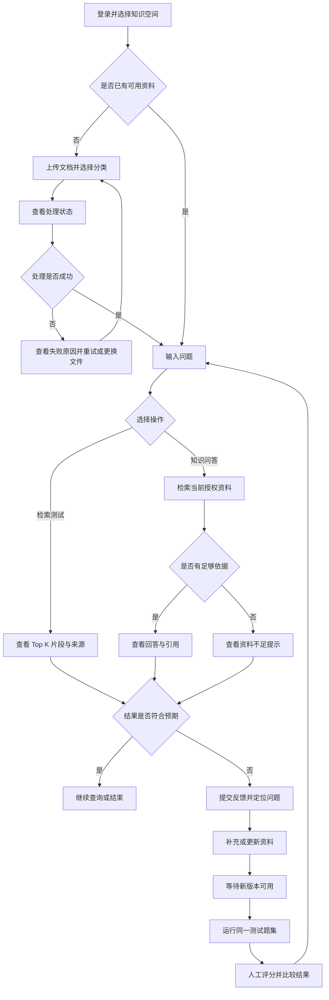
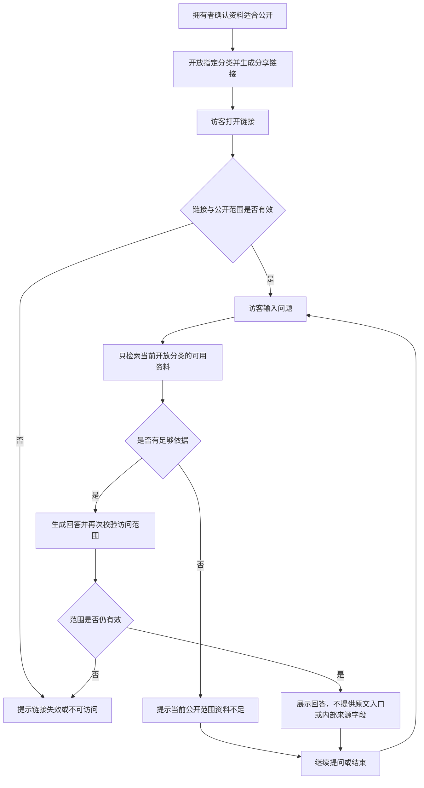
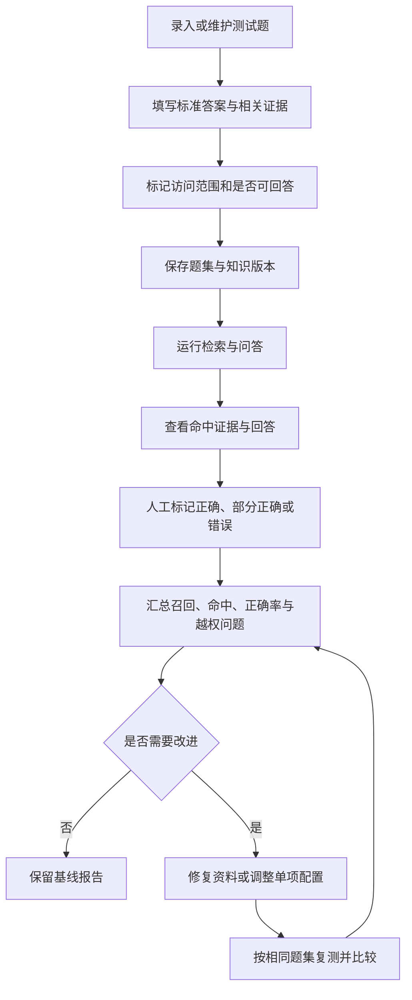

# V2需求分析文档

> 产品：知溯 AiKnowledge
> 更新日期：2026-09-30
> 定位：面向中国个人知识工作者与小团队的可信知识工作台，主要作为简历项目
> 状态：需求稿；任务列表表示待验收要求，不表示当前功能全部缺失
> 原则：复用 V1，先完成最小闭环，再用评估结果决定扩展

## 1. 需求背景

### 1.1 项目背景

V1 解决了个人与小团队将分散文档转化为可查询知识空间的问题：拥有者上传资料、提问并核对来源；访客通过分享链接，只围绕公开空间已开放分类提问。

V2 延续这些用户与场景，重点解决三个问题：

1. 回答出错时，无法快速分辨是资料缺失、检索遗漏还是生成错误。
2. 调整检索参数后，缺少固定题集证明效果是否改善。
3. 分享范围、文档版本和资料状态变化后，需要验证回答仍符合当前访问边界。

### 1.2 目标用户与典型场景

| 用户 | 典型场景 | 核心诉求 |
| --- | --- | --- |
| 个人知识工作者 | 查询课程、论文、笔记、项目文档 | 快速找到答案，并核对依据 |
| 公开空间访客 | 了解个人工作经历、项目经验、产品介绍 | 在已开放范围内获得回答 |
| 小团队成员 | 查询产品 FAQ、制度与项目资料 | 减少重复查找和咨询 |
| 知识库负责人 | 处理无答案问题与错误反馈 | 定位原因，补充资料，验证修复 |

建议主演示采用个人项目经验，辅助演示采用模拟小团队 FAQ。正式数据使用范围和资源预算尚未确定，前期使用合成资料。

### 1.3 竞品调研与项目价值

前期调研已核对官方资料，结论如下：

| 竞品 | 已核验能力 | 对本项目的启示 |
| --- | --- | --- |
| Dify | 知识库、混合检索、重排、元数据、检索测试 | 上传文档后聊天已是基础能力 |
| RAGFlow | 检索测试、关键词与向量组合、重排与过滤 | 先判断是否找到正确证据，再检查生成 |
| FastGPT | Dataset 数据组织、向量检索、重排配置 | 资料结构和查询质量同样重要 |
| AnythingLLM | 文档 RAG、重排、聊天嵌入与访问次数限制 | 个人工具与分享问答已有成熟替代方案 |
| Google Notebook 官方帮助 | 基于来源问答、分享与聊天视图 | 隐藏资料界面不等于撤销底层访问权限 |

来源：[Dify](https://docs.dify.ai/en/cloud/use-dify/knowledge/create-knowledge/setting-indexing-methods)、[RAGFlow](https://ragflow.io/docs/retrieval_testing)、[FastGPT](https://doc.fastgpt.io/en/guide/dataset/dataset_engine)、[AnythingLLM 文档问答](https://docs.anythingllm.com/chatting-with-documents/introduction)、[AnythingLLM 分享组件](https://docs.anythingllm.com/features/chat-widgets)、[Google Notebook 分享说明](https://support.google.com/gemininotebook/answer/16206563?hl=en)。

**判断：作为简历项目值得继续；商业化价值尚未验证。** V2 的展示价值来自可解释的失败定位、可复现的效果评估和访问边界验证，不来自功能数量。混合检索、重排和引用不能单独宣称为独有优势。

本结论是基于官方能力与项目现状的分析，未进行竞品登录实测、付费访谈或生产性能测试。前期研究采用多轮联网核对，未调用独立 Deep Research 专项功能。

### 1.4 现有基础与范围原则

仓库已有文档入库、pgvector 检索、拥有者与访客范围控制、引用、反馈、题集版本及运行比较。V2 复用这些能力，主要补齐检索展示、评估证据和用户操作闭环。

《V1验收报告》仍记录前端入口、空间删除清理、真实运行时与用户试用等缺口。它们属于已有功能收尾，不应包装为 V2 新能力；正式发布前必须通过验收。

公开问答的承诺限定为：访客不能直接访问原文件，不能检索私密空间和未开放分类。已经允许公开并进入模型上下文的资料，可能通过回答被复述，不能承诺内容绝不会被重构。该风险由 OWASP 的提示注入与敏感信息披露说明支持：[Prompt Injection](https://genai.owasp.org/llmrisk/llm01-prompt-injection/)、[Sensitive Information Disclosure](https://genai.owasp.org/llmrisk/llm022025-sensitive-information-disclosure/)。

## 2. MVP 最小可行功能点

### 2.1 MVP 目标

在 V1 基础上完成一条最小闭环：

> 选择知识空间 → 上传或选择可用资料 → 提问并查看检索证据 → 查看回答或拒答 → 对失败问题反馈 → 补充资料 → 用同一组测试题复测。

前期只交付“基础检索 + 完整问答 + 轻量评估”。高级检索优化全部进入后续扩展，避免一次引入多个模型与检索路径。

### 2.2 P0-1：复用知识空间与文档管理

- 保留私密空间、公开空间与分类开放规则。
- 沿用 PDF、DOCX、Markdown、TXT 上传、处理状态、失败重试与删除。
- 仅可用、启用且符合当前有效版本与时间范围的资料参与问答。
- 文档更新后使用新活动版本；删除后不再参与新的检索。
- 补齐核心操作入口，不重新开发账号体系、存储和任务队列。

**验收：** 拥有者可以完成创建空间、上传、等待可用、提问和删除；处理中或失败的资料不会被当成可查询资料。

### 2.3 P0-2：独立检索与 Top K 展示

增加拥有者使用的“检索测试”入口，输入问题后直接查看相关片段，不调用生成模型。

最小结果包含：片段文本、排序、相似度、文件名、可用的页码或位置。支持设置 Top K，默认值由现有配置提供。

- 保留不依赖 LangChain/LlamaIndex 的 Embedding、余弦相似度与 Top K 示例。
- 验证手写余弦、归一化内积与数据库检索的数值关系。
- 正式存储沿用 pgvector，不新增 FAISS 双写或分布式向量数据库。
- 空问题、空资料与 K 超过片段数量时给出明确结果。
- 访客不能访问检索测试、原文片段或内部诊断。

**验收：** 可单独演示“输入问题 → Embedding → Top K 片段”；能够判断目标资料是否被找到。

### 2.4 P0-3：完整问答、引用与拒答

复用现有问答链路：检索授权片段 → 组装上下文 → 调用 LLM → 校验回答 → 返回结果。

- 拥有者查看回答、引用来源与对应片段。
- 访客只看到已开放范围内的回答或资料不足提示。
- 资料不足与模型故障分别提示，不将故障计为正确拒答。
- 引用必须对应实际证据；引用存在不代表结论正确，评测时需人工核对。
- 连续追问保留现有能力，不在 MVP 新增自动查询改写。

**验收：** 正确问题能展示答案与依据；资料没有覆盖的问题能拒答；模型调用失败能显示错误。

### 2.5 P0-4：公开分享范围控制

沿用 V1 分享链接，不增加新的发布体系。

- 访客只检索当前链接允许、当前仍开放的分类。
- 未授权内容不进入候选结果或模型上下文。
- 分类关闭、链接撤销和文档删除对新请求立即生效；在途请求输出前重新检查范围。
- 历史上下文和缓存不能重新带入已关闭内容。
- 分享前提醒拥有者只放入适合公开的资料。

**验收：** 私密、关闭分类、撤销链接、跨空间、删除及过期场景均有回归用例；范围外候选、上下文和公开输出计数为零。

### 2.6 P0-5：轻量评估与反馈复测

复用 V1 测试题、人工评分和运行对比，补足必要操作与记录。

- 先用 10—20 题打通操作闭环，正式 V2 验收补足 50 题。
- 每题记录问题、标准答案、相关文档及原文证据、访问范围和是否可回答。
- 保存题集版本、知识版本和检索配置，避免前后运行条件不明。
- 人工评分为正确、部分正确、错误；支持记录错误原因。
- 用户反馈后手动补充资料或调整配置，再运行同一题集。
- 结果包含检索是否命中、回答评分、拒答表现和运行错误。
- MVP 不增加自动评审模型、复杂可视化平台或自动生成题集。

**验收：** 能展示一次失败问题的反馈、修复与复测，并导出或查看基线报告。

### 2.7 最小指标口径

| 指标 | 定义 |
| --- | --- |
| Recall@K | 对可回答题，按题平均：检索命中的标注相关证据数 ÷ 全部标注相关证据数 |
| Retrieval Accuracy（Hit@K） | 可回答题中，Top K 至少命中一条相关证据的问题占比 |
| Answer Accuracy | 可回答题中，人工判定完全正确的回答占比；部分正确单列 |
| 正确拒答率 | 无答案或超范围题中，正确说明资料不足的问题占比 |
| 越权问题数 | 出现范围外候选、上下文或输出的用例数量；任一非零阻断发布 |

重复片段不重复计数；文档级与证据级指标分开标注。多证据题命中一条不等于具备完整回答依据。模型故障不能计入正确拒答。

50 题覆盖事实、精确关键词、同义表达、多证据、连续追问、无答案及权限变化。按类型分成 35 题调优与 15 题保留验收；分块变化后以原文位置映射新片段，不依赖旧 chunk ID。小题集只支持项目内初步判断，不能证明普遍准确率。

### 2.8 MVP 非目标与完成定义

不加入 BM25、混合检索、真实 Reranker、查询改写、自动评审、公开稿发布、OCR、Agent、复杂团队治理、订阅支付或新数据连接器。

MVP 完成需满足：

1. V1 主流程与真实运行时通过必要验收。
2. 拥有者能独立查看 Top K 证据、回答与来源。
3. 访客只能使用当前有效公开范围。
4. 固定题集能复测，指标计算口径明确。
5. 至少完成一条反馈推动修复的案例。
6. 未覆盖、失败和未验收能力均明确记录。

不承诺固定工期或准确率提升；先取得真实基线，再决定后续投入。

## 3. 后续可以做的扩展功能点

### 3.1 优先级定义

- **P1：MVP 完成后优先实施。** 解决评估中反复出现的检索问题。
- **P2：确认用户需要或资源充足后实施。** 增强公开分享、维护与诊断体验。
- **P3：有稳定使用或商业需求后实施。** 团队、企业和平台能力。

### 3.2 P1：检索质量提升

| 功能 | 解决的问题 | 验证方式 |
| --- | --- | --- |
| 结构分块与片段预览 | 证据被切断或上下文过长 | 与现有长度分块比较召回、证据覆盖和索引大小 |
| 中文 BM25 | 专有名词、编号、版本和错误码检索遗漏 | 与纯向量比较精确关键词题 |
| Hybrid Search | 关键词与语义问题单一路径表现不一致 | 使用 RRF 融合，按片段去重并记录各路排名 |
| 真实 Reranker | 正确证据已召回但排名靠后 | 比较重排前后 Top K、答案和延迟 |
| 更丰富的元数据过滤 | 按主题、版本和有效时间缩小范围 | 验证过滤效果与候选数量，权限过滤始终强制执行 |

每次只加入一项主要变化，沿用同一题集和知识版本。没有收益的优化不设为默认；优化不得破坏公开范围。检索召回与生成质量分开评价。

可用 LlamaIndex 做实验适配，正式业务鉴权保持在服务端。Python 3.14 和模型依赖兼容性需先验证。[LlamaIndex BM25](https://developers.llamaindex.ai/python/framework/integrations/retrievers/bm25_retriever/)

### 3.3 P2：可信分享与维护闭环

| 功能 | 价值 | 前置条件 |
| --- | --- | --- |
| 单次查询改写 | 补全指代与口语表达 | 保留原问题，证明不会丢失编号和限制条件 |
| 公开回答稿 | 访客只检索经过审核的公开内容副本 | 用户确认发布方案与更新流程 |
| 反馈转回归题 | 把真实失败问题纳入持续验证 | 拥有者审核标准答案和证据 |
| 阶段诊断与同题对比 | 区分解析、召回、排序和生成问题 | MVP 已有可追踪运行记录 |
| 文档更新影响与冲突提示 | 发现更新后变化的答案或矛盾资料 | 文档版本与证据映射完整 |
| 分享有效期、访问密码和额度 | 控制公开访客访问与成本 | 分享流程已稳定 |
| 静态 FAQ 与问答结合 | 常见问题直接展示，复杂问题再提问 | 用访客任务验证优于纯聊天 |
| 辅助自动评测 | 降低人工复核负担 | 人工标注与固定评分标准，自动结果仅作辅助 |

公开回答稿只能降低敏感原文进入上下文的机会，不能承诺公开内容绝不被复述。Ragas Context Recall 与本项目集合式 Recall@K 口径不同，接入时需明确区分。[Ragas 指标](https://docs.ragas.io/en/stable/concepts/metrics/available_metrics/context_recall/)

### 3.4 P3：团队与产品扩展

- 团队邀请、细粒度角色、审批和操作审计。
- 按真实需求扩展网页、仓库、网盘等数据同步。
- OCR、复杂表格和多模态解析。
- 开放 API、业务系统集成和 Agent 工具调用。
- 订阅权益、支付和企业部署。
- 明确规模瓶颈后再评估替换或扩展向量基础设施。

这些功能需要新的用户证据和资源确认，不因已有接口或竞品支持就自动进入范围。

## 4. 用户操作的具体流程图

### 4.1 拥有者：上传、问答与改进

### 4.2 公开访客：限定范围问答

访客问答始终受服务端范围限制；流程图中的“不提供原文入口”不表示已公开信息不会出现在回答中。

### 4.3 拥有者：轻量质量自测

## 5. 需求功能核对清单

> 以下均为待核对任务。已有实现应经验证后勾选，不因文档重新整理就认定需要重做。

### 5.1 范围与 V1 发布门禁

- [ ] 目标用户和使用场景与 V1 保持一致。
- [ ] MVP 只交付基础检索、完整问答与轻量评估。
- [ ] 已区分新增功能、复用功能与 V1 未完成事项。
- [ ] 空间和分类的核心管理入口可用。
- [ ] 文档、历史记录、反馈与评测的必要操作可完成。
- [ ] 空间删除后权限立即失效，物理清理可重试并最终完成。
- [ ] 已完成隔离环境迁移和真实存储、队列、模型链路验收。
- [ ] 已说明资料用途、外部模型调用范围、保存与删除方式。

### 5.2 文档与知识空间

- [ ] 可选择私密或公开知识空间。
- [ ] 可管理公开分类的开放状态。
- [ ] PDF、DOCX、Markdown、TXT 沿用现有导入链路。
- [ ] 可区分处理中、可用与失败状态。
- [ ] 处理失败可查看原因并重试。
- [ ] 更新后检索只使用活动版本。
- [ ] 删除、停用或过期资料不参与新问答。
- [ ] 扫描件和不支持内容有明确提示。

### 5.3 独立检索

- [ ] 拥有者有独立检索测试入口。
- [ ] 不调用 LLM 即可返回 Top K 片段。
- [ ] 结果展示片段、排序、分数及来源位置。
- [ ] 手写示例不依赖 LangChain/LlamaIndex。
- [ ] 余弦相似度、归一化内积与数据库距离转换已核对。
- [ ] 空问题、空索引与 K 超出数量有明确处理。
- [ ] 访客不能访问检索诊断或原文片段。

### 5.4 问答、引用与公开边界

- [ ] 拥有者可获得回答并查看实际依据。
- [ ] 引用中的关键结论可由原文支持。
- [ ] 资料不足与模型故障分别提示。
- [ ] 分享链接只允许当前有效开放分类。
- [ ] 私密与关闭分类不进入候选或上下文。
- [ ] 分类关闭、链接撤销、删除和过期场景有回归用例。
- [ ] 在途请求输出前重新验证范围。
- [ ] 历史上下文和缓存不会带回已关闭内容。
- [ ] 访客输出不包含原文入口、来源字段和内部诊断。
- [ ] 分享提醒明确：公开资料可能通过回答被复述。
- [ ] 越权候选、上下文和输出计数均为零。

### 5.5 反馈与轻量评估

- [ ] 用户可提交评价与原因。
- [ ] 可用 10—20 题完成首次操作闭环。
- [ ] 正式 V2 验收准备了 50 题。
- [ ] 每题包含标准答案、证据、访问范围和可回答性。
- [ ] 调优题与保留验收题已分开。
- [ ] 题集、知识与配置版本可追踪。
- [ ] 检索命中与回答质量分开记录。
- [ ] 可人工标记正确、部分正确和错误。
- [ ] Recall@K、Hit@K、Answer Accuracy 口径明确。
- [ ] 正确拒答与模型错误分别统计。
- [ ] 至少一个失败问题完成反馈、修复和同题复测。
- [ ] 有一份可复核的基线报告。

### 5.6 后续扩展进入条件

- [ ] 只有出现重复检索失败后，才选择对应的 P1 优化。
- [ ] 每项优化与基线使用相同题集和明确知识版本。
- [ ] 优化报告包含改善、退步、延迟和成本。
- [ ] 新检索路径使用同一服务端授权范围。
- [ ] 公开回答稿等新方案实施前已确认。
- [ ] 预算、设备和依赖兼容性已确认后才增加模型。
- [ ] 未将 Agent、支付、复杂企业治理加入 MVP。

### 5.7 项目展示与用户验证

- [ ] 有一套合成个人项目或小团队 FAQ 演示资料。
- [ ] 可演示正确回答、有效引用、资料不足拒答和范围限制。
- [ ] 已邀请至少 5 名目标用户体验并记录任务完成情况。
- [ ] 至少 80% 的体验用户能独立完成对应主流程。
- [ ] 已记录是否重复使用及选择本产品的具体原因。
- [ ] README、演示与验收记录保持一致。
- [ ] 简历只写实际测得的指标和已验证成果。
- [ ] 未把小样本验证描述为商业成功或企业合规认证。
