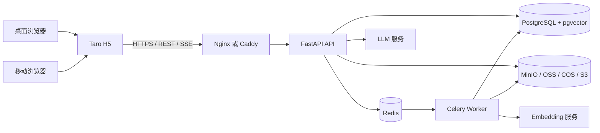
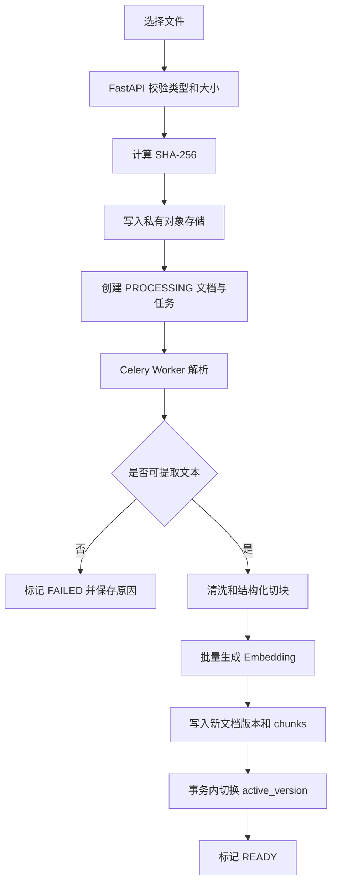

# 企业与个人私有知识库 RAG 技术方案

> 文档状态：MVP 技术方案稿  
> 编制日期：2026-09-09  
> 对应需求：《企业与个人私有知识库 RAG 产品需求分析文档》  
> 已确定技术：FastAPI、Taro  
> 目标终端：桌面浏览器与移动浏览器的响应式网页  
> 不包含：Windows/macOS 安装客户端、Android/iOS 原生 App

## 1. 方案结论

本项目建议采用以下总体方案：

> Taro + React + TypeScript 构建一套 H5 前端，通过响应式布局同时适配桌面浏览器和移动浏览器；FastAPI 采用模块化单体架构提供业务 API；文档解析和向量化由独立 Celery Worker 执行；PostgreSQL + pgvector 同时承载业务数据和向量数据；Redis 提供任务队列、限流和短期状态；原始文件保存到 MinIO 或兼容 S3 的对象存储。

该架构可以完整覆盖 MVP 的核心闭环：

1. 创建私密空间或公开空间；
2. 在公开空间中创建并开放指定分类；
3. 上传 PDF、DOCX、Markdown 和 TXT；
4. 异步解析、切块、向量化并展示处理状态；
5. 空间所有者获得带来源的回答；
6. 访客通过分享链接提问，但不能获得文件名、页码和原文片段；
7. 没有足够证据时明确拒答；
8. 通过反馈和测试题持续验证知识库质量。

MVP 不需要拆分微服务，也不需要引入独立向量数据库、Elasticsearch、复杂工作流或 Agent 框架。模块化单体更适合当前规模，能够降低部署和调试成本，同时保留后续拆分能力。

## 2. 设计原则

### 2.1 权限过滤先于模型调用

私密空间、关闭分类和已删除文档必须在数据库检索阶段被排除，不能依赖提示词要求模型“不要泄漏”。模型只能看到当前请求有权访问的片段。

### 2.2 公开回答与所有者回答使用不同接口模型

所有者回答可以携带文件名、页码、原文片段和引用；访客回答的响应结构中不包含这些字段，而不是返回以后再由前端隐藏。

### 2.3 文档状态与向量版本原子切换

只有解析、切块和向量化全部成功后，文档才进入 `READY`。重新处理文档时先构建新版本，完成后一次性切换，避免半成品进入问答。

### 2.4 拒答是正式业务结果

回答结果不仅有“成功”和“失败”，还应区分资料不足、超出范围和资料冲突，并记录这些结果供后续改进。

### 2.5 桌面端与移动端共享业务代码

两端使用同一个 Taro H5 项目、同一套页面和 API 客户端。通过响应式布局、组件变体和网络降级策略适配不同屏幕与浏览器，不维护两套前端。

### 2.6 模型供应商可替换

业务层只依赖内部的生成模型和 Embedding 接口，不直接散落调用某一家厂商 SDK。模型、向量维度、提示词版本和检索参数都需要被记录和版本化。

## 3. 系统架构



### 3.1 组件职责

| 组件 | 主要职责 |
| --- | --- |
| Taro H5 | 所有者后台、公开访客页、文件上传、问答、反馈和评测页面 |
| Nginx/Caddy | HTTPS、静态资源、反向代理、H5 路由回退、基础安全响应头 |
| FastAPI | 身份认证、权限判断、空间和分类管理、问答编排、引用和反馈 API |
| Celery Worker | 文档解析、切块、Embedding、重试、旧版本和对象文件清理 |
| PostgreSQL | 用户、空间、分类、文档、对话、引用、反馈和评测数据 |
| pgvector | 文档片段向量存储和相似度检索 |
| Redis | Celery Broker、访客限流、短期缓存和分布式锁 |
| 对象存储 | 私有保存用户上传的原始文档 |
| LLM/Embedding 服务 | 回答生成、问题改写和向量生成 |

### 3.2 架构形态

FastAPI 采用模块化单体，但运行时至少拆成两个进程：

- `api`：处理交互式请求和流式问答；
- `worker`：处理耗时、可重试的文档任务。

文档解析和 Embedding 不使用 FastAPI `BackgroundTasks`。官方文档说明，重计算或需要跨进程执行的后台任务应使用 Celery 等独立任务工具；`BackgroundTasks` 更适合轻量的同进程操作。

## 4. 技术选型

### 4.1 前端

| 类别 | 选型 | 说明 |
| --- | --- | --- |
| 跨端框架 | Taro H5 | 输出响应式网页，兼容桌面和移动浏览器 |
| UI 框架 | React + TypeScript | 类型安全、生态完整 |
| 构建工具 | Taro 官方构建链 | 生产目标固定为 `h5` |
| 服务端状态 | TanStack Query | 请求缓存、失效、重试和轮询 |
| 客户端状态 | Zustand | 登录态、布局状态、上传队列等轻量状态 |
| API 客户端 | Orval 生成 | 从 FastAPI OpenAPI 生成类型和请求客户端 |
| 样式 | SCSS/CSS Modules + CSS Variables | 支持响应式布局和主题变量 |
| E2E 测试 | Playwright | 验证桌面和移动视口 |

不建议在 MVP 阶段强依赖大型组件库。可以建立少量基础组件，例如按钮、输入框、弹窗、抽屉、状态标签和表格，以降低 Taro 版本升级和移动端样式冲突风险。

### 4.2 后端

| 类别 | 选型 | 说明 |
| --- | --- | --- |
| Web 框架 | FastAPI | 异步接口、依赖注入、OpenAPI |
| 数据验证 | Pydantic 2 | 请求、响应和配置模型 |
| ORM | SQLAlchemy 2 | API 使用异步会话，事务边界明确 |
| 数据迁移 | Alembic | 管理数据库结构版本 |
| 数据库驱动 | asyncpg | FastAPI 异步访问 PostgreSQL |
| 任务队列 | Celery + Redis | 文档任务、重试和并发控制 |
| 密码与令牌 | pwdlib/Argon2 + PyJWT | 用户密码和短期访问令牌 |
| HTTP 客户端 | HTTPX | 异步调用模型服务 |
| 测试 | pytest + HTTPX | 单元测试和 API 集成测试 |
| 工程质量 | Ruff + mypy | 格式、检查和类型校验 |

### 4.3 数据与文件

| 类别 | 选型 | 说明 |
| --- | --- | --- |
| 主数据库 | PostgreSQL | 业务事务、权限条件、历史记录 |
| 向量能力 | pgvector | 向量与权限元数据一起查询 |
| 开发对象存储 | MinIO | 本地环境与 S3 接口兼容 |
| 生产对象存储 | OSS/COS/S3 兼容服务 | 通过统一适配器切换 |
| PDF | pypdf | MVP 只支持可提取文本的 PDF |
| DOCX | python-docx | 提取段落、标题和表格中的纯文本 |
| Markdown | markdown-it-py | 保留标题层级和正文结构 |
| TXT | charset-normalizer | 检测编码后转换为 UTF-8 |

扫描 PDF、OCR、复杂表格、图片语义和演示文稿不进入 MVP。系统应识别“几乎没有可提取文本”的 PDF，并明确标记为不支持或处理失败。

### 4.4 模型层

定义以下内部协议：

```text
EmbeddingClient.embed(texts) -> vectors
LLMClient.generate(messages, context) -> answer
LLMClient.stream(messages, context) -> token stream
```

配置至少包括：

- `provider`；
- `base_url`；
- `model_name`；
- `embedding_model_name`；
- `embedding_dimension`；
- 超时和重试次数；
- 单次输入和输出限制。

MVP 固定使用一个 Embedding 模型。切换 Embedding 模型时创建新的知识库向量版本并重新向量化，不能把不同模型生成的向量混合检索。

## 5. 前端方案

### 5.1 终端范围

本方案支持：

- Windows/macOS/Linux 上的现代桌面浏览器；
- Android/iOS 上的现代移动浏览器；
- 微信内置浏览器中的基础访问和问答；
- 桌面和移动浏览器中的响应式布局。

本方案不承诺：

- 离线运行；
- 浏览器插件；
- 原生系统通知；
- 原生文件系统集成；
- 应用商店发布。

### 5.2 响应式设计

建议使用以下布局断点，具体值可以在视觉设计阶段微调：

| 视口 | 布局 |
| --- | --- |
| `< 768px` | 移动端单栏，导航使用抽屉或底部入口 |
| `768px - 1199px` | 平板/窄桌面，两栏可折叠布局 |
| `>= 1200px` | 桌面三栏：空间导航、主要内容、引用详情 |

移动端需要遵循：

- 主要可点击区域高度不小于 44px；
- 输入框固定时处理虚拟键盘遮挡；
- 引用详情使用底部抽屉，不永久占用右侧空间；
- 表格降级为卡片列表；
- 上传队列显示单文件进度、失败原因和重试按钮；
- 聊天页使用动态视口单位，避免移动浏览器地址栏导致高度跳动。

桌面端需要遵循：

- 空间和分类使用侧边栏；
- 文档管理使用表格；
- 所有者引用使用右侧详情面板；
- 支持拖拽上传作为增强功能，但保留文件选择按钮；
- 主要操作不依赖鼠标悬停。

### 5.3 页面结构

```text
pages/
├── login/                 登录
├── spaces/                空间列表
├── space-detail/          空间概览
├── categories/            公开分类管理
├── documents/             文档上传和管理
├── owner-chat/            所有者问答和引用
├── public-chat/           分享链接访客问答
├── feedback/              反馈记录
└── evaluation/            测试题和评测结果
```

### 5.4 路由

H5 使用 browser 路由模式，公开入口形如：

```text
https://example.com/s/{share_token}
```

Nginx/Caddy 必须把未知前端路由回退到 `index.html`。首次访问分享地址后，前端调用服务端交换短期访客会话，并通过 `history.replaceState` 清除地址栏中的原始令牌，减少令牌进入截图、历史记录、Referer 和分析日志的概率。

### 5.5 文件上传

H5 使用平台适配组件封装文件选择和 `Taro.uploadFile`：

- `accept` 限制为 `.pdf,.docx,.md,.txt`；
- 支持多选；
- 每个文件独立调用上传接口；
- 默认最多 2～3 个并发上传；
- 支持进度显示和取消；
- 上传成功后轮询文档处理状态；
- 页面刷新后从服务端重新恢复任务状态。

客户端校验只用于改善体验，文件类型、大小和内容仍必须由服务端重新校验。

### 5.6 流式问答与兼容降级

定义两种问答模式：

1. `stream=true`：返回 `text/event-stream`，H5 使用原生 `fetch + ReadableStream`；
2. `stream=false`：等待服务端生成完成后返回普通 JSON。

启动时通过能力检测判断浏览器是否支持可靠流读取：

- 支持时展示逐字生成；
- 微信内置浏览器或旧移动浏览器不支持时自动使用普通 JSON；
- 两种模式共用同一个业务接口和回答数据结构；
- 用户中断或页面离开时取消前端请求，服务端尽可能终止模型请求。

FastAPI 流式生成前必须完成身份校验、访问范围计算和数据库读取，不能让数据库事务跟随整个流式响应保持打开。

## 6. 后端模块设计

建议目录结构：

```text
backend/
├── app/
│   ├── main.py
│   ├── api/
│   │   ├── dependencies.py
│   │   └── v1/
│   ├── core/
│   │   ├── config.py
│   │   ├── security.py
│   │   ├── errors.py
│   │   └── logging.py
│   ├── domain/
│   │   ├── auth/
│   │   ├── spaces/
│   │   ├── documents/
│   │   ├── retrieval/
│   │   ├── conversations/
│   │   └── evaluation/
│   ├── models/
│   ├── repositories/
│   ├── services/
│   ├── infrastructure/
│   │   ├── database/
│   │   ├── storage/
│   │   ├── llm/
│   │   └── queue/
│   └── workers/
├── migrations/
├── tests/
├── pyproject.toml
└── uv.lock
```

模块之间按照以下方向依赖：

```text
API → Application Service → Domain/Repository Interface → Infrastructure
```

路由函数只负责协议转换和依赖注入，不直接编写复杂 SQL、模型提示词或文档解析逻辑。

## 7. 数据模型

### 7.1 用户与认证

#### users

- `id`
- `email`
- `password_hash`
- `status`
- `created_at`
- `updated_at`

#### refresh_tokens

- `id`
- `user_id`
- `token_hash`
- `expires_at`
- `revoked_at`
- `replaced_by_id`

### 7.2 空间、分类和分享

#### knowledge_spaces

- `id`
- `owner_user_id`
- `name`
- `description`
- `visibility`: `PRIVATE` / `PUBLIC`
- `guest_feedback_enabled`
- `created_at`
- `updated_at`
- `deleted_at`

#### categories

- `id`
- `space_id`
- `name`
- `description`
- `is_open`
- `sort_order`
- `created_at`
- `updated_at`

#### share_links

- `id`
- `space_id`
- `token_hash`
- `status`: `ACTIVE` / `REVOKED`
- `created_by`
- `created_at`
- `revoked_at`
- `expires_at`：MVP 可以为空，但结构预留

关键约束：

- 只有 `PUBLIC` 空间可以创建分类和分享链接；
- 分享链接必须由服务端生成；
- 原始令牌只在创建时返回一次；
- 数据库只保存令牌哈希；
- 分类开放状态由服务端实时查询，不能缓存为长期授权结果。

### 7.3 文档与向量

#### documents

- `id`
- `space_id`
- `category_id`：私密空间允许为空
- `original_filename`
- `storage_key`
- `mime_type`
- `size_bytes`
- `sha256`
- `status`
- `active_version_id`
- `failure_code`
- `failure_message`
- `created_at`
- `updated_at`
- `deleted_at`

#### document_versions

- `id`
- `document_id`
- `version_number`
- `parser_version`
- `embedding_provider`
- `embedding_model`
- `embedding_dimension`
- `chunk_config`
- `status`
- `created_at`
- `activated_at`

#### chunks

- `id`
- `document_id`
- `document_version_id`
- `space_id`
- `category_id`
- `ordinal`
- `heading_path`
- `page_number`
- `content`
- `content_hash`
- `token_count`
- `embedding`
- `is_active`

在 `chunks` 中冗余保存 `space_id` 和 `category_id`，目的是让每次检索都能直接执行权限过滤。必须通过服务层和数据库约束保证这些字段与文档一致。

建议索引：

- `documents(space_id, status)`；
- `categories(space_id, is_open)`；
- `chunks(space_id, category_id, is_active)`；
- `chunks.embedding` 的 pgvector HNSW 余弦索引；
- `share_links(token_hash)` 唯一索引；
- 所有外键和软删除查询相关索引。

### 7.4 对话、引用和反馈

#### conversations

- `id`
- `space_id`
- `actor_type`: `OWNER` / `GUEST`
- `owner_user_id`
- `share_link_id`
- `created_at`
- `updated_at`

#### messages

- `id`
- `conversation_id`
- `role`
- `question`
- `answer`
- `answer_status`
- `retrieval_config_snapshot`
- `model_snapshot`
- `created_at`

`answer_status`：

- `ANSWERED`；
- `INSUFFICIENT_EVIDENCE`；
- `OUT_OF_SCOPE`；
- `CONFLICT`；
- `FAILED`。

#### citations

- `id`
- `message_id`
- `chunk_id`
- `rank`
- `score`
- `quoted_text`

`quoted_text` 用于保存回答当时看到的证据快照，防止文档后续更新导致历史引用含义变化。该字段只允许空间所有者访问。

#### feedback

- `id`
- `message_id`
- `actor_type`
- `rating`: `USEFUL` / `USELESS` / `NEEDS_CORRECTION`
- `reason`
- `comment`
- `created_at`

### 7.5 轻量评测

#### eval_cases

- `id`
- `space_id`
- `question`
- `scope_type`
- `category_id`
- `expected_behavior`
- `reference_answer`

#### eval_runs

- `id`
- `space_id`
- `knowledge_snapshot`
- `model_snapshot`
- `retrieval_config_snapshot`
- `started_at`
- `completed_at`

#### eval_results

- `id`
- `run_id`
- `case_id`
- `answer`
- `answer_status`
- `used_chunk_ids`
- `manual_grade`: `CORRECT` / `PARTIAL` / `WRONG`
- `authorization_leak`
- `created_at`

## 8. 权限与检索范围

### 8.1 RetrievalScope

所有检索服务必须接收服务端构造的 `RetrievalScope`，而不是直接接收客户端提交的分类列表：

```text
RetrievalScope
├── actor_type
├── owner_user_id 或 share_link_id
├── space_id
├── allowed_category_ids
├── include_private
└── scope_version
```

所有者流程：

1. 验证登录身份；
2. 验证 `space.owner_user_id == current_user.id`；
3. 根据当前空间生成检索范围。

访客流程：

1. 验证访客会话对应的分享链接；
2. 验证分享链接未撤销、未过期；
3. 验证空间仍为公开空间；
4. 实时查询该空间所有 `is_open=true` 的分类；
5. 只使用这些分类生成检索范围。

### 8.2 检索必须满足的条件

概念 SQL：

```sql
SELECT c.id, c.content, c.page_number,
       c.embedding <=> :question_embedding AS distance
FROM chunks AS c
JOIN documents AS d ON d.id = c.document_id
WHERE c.space_id = :space_id
  AND c.is_active = TRUE
  AND d.status = 'READY'
  AND d.deleted_at IS NULL
  AND (
      :is_owner = TRUE
      OR c.category_id = ANY(:allowed_category_ids)
  )
ORDER BY c.embedding <=> :question_embedding
LIMIT :top_k;
```

`allowed_category_ids` 必须来自数据库，绝不能直接相信前端参数。

### 8.3 独立响应模型

所有者接口可以返回：

```json
{
  "status": "ANSWERED",
  "answer": "...",
  "citations": [
    {
      "document_name": "...",
      "page_number": 3,
      "snippet": "..."
    }
  ]
}
```

访客接口只能返回：

```json
{
  "status": "ANSWERED",
  "answer": "...",
  "scope_notice": "回答仅基于当前公开区域"
}
```

访客模型中不定义 `citations`，避免未来某次序列化或前端修改意外暴露来源。

## 9. 文档处理流程



### 9.1 上传校验

- 可配置的单文件大小上限，MVP 建议默认 20MB；
- 检查扩展名和实际 MIME；
- 文件名仅作展示，不作为存储路径；
- 对象存储键使用随机 ID；
- 检测加密 PDF、损坏 DOCX、异常压缩比和空文件；
- 不在应用日志记录文档正文；
- 使用 SHA-256 识别同一空间中的重复文件。

### 9.2 切块策略

初始参数：

- 以标题、段落和页为结构边界；
- 每块约 400～700 tokens；
- 重叠约 80～120 tokens；
- 保留标题路径、页码、段落序号和文档版本；
- 过短相邻段落合并；
- 超长段落按句子继续切分。

上述参数必须保存在 `document_versions.chunk_config` 和 `eval_runs.retrieval_config_snapshot` 中，后续根据评测结果调整。

### 9.3 幂等与重试

Celery 任务使用 `document_version_id` 作为幂等键：

- 重试前检查版本状态；
- 同一版本只允许一个活动处理任务；
- Embedding 批次失败可以从批次断点重试；
- 完成前不修改 `active_version_id`；
- 任务状态以 PostgreSQL 为准，Redis 只传递消息。

### 9.4 删除

删除操作分两步：

1. 数据库事务内立即把文档和 chunk 标记为不可检索；
2. Worker 异步删除向量记录和对象存储文件。

即使异步物理清理暂时失败，新问答也不能再检索到已删除文档。

## 10. RAG 问答流程

### 10.1 处理步骤

```text
用户问题
→ 输入安全与长度检查
→ 连续对话问题改写
→ 构造 RetrievalScope
→ 生成问题向量
→ 权限过滤后的 Top-K 召回
→ 证据门控
→ 基于证据生成回答
→ 引用 ID 校验
→ 结果分类
→ 所有者或访客响应序列化
→ 保存历史与指标
```

### 10.2 连续对话

- 每个对话固定绑定一个空间和一种访问身份；
- 每次访客追问都重新校验分享链接和开放分类；
- 只取最近若干轮对话或摘要，避免上下文无限增长；
- 历史消息只能帮助理解代词和省略，不能扩大检索权限；
- 不能把另一个空间的会话 ID 用于当前请求。

### 10.3 检索策略

MVP 第一版建议：

- 向量召回 Top 12～20；
- 按相似度和重复内容去重；
- 最终送入模型 4～6 个片段；
- 暂不引入 Elasticsearch；
- 如果评测显示召回精度不足，再增加轻量 reranker，而不是一开始增加复杂度。

pgvector 使用余弦距离。数据量较小时可优先保证准确性；数据量增长后启用 HNSW，并针对带分类过滤的查询验证召回率，必要时使用 iterative scan 或调整索引参数。

### 10.4 证据门控与拒答

不能使用未经评测的固定相似度阈值作为永久规则。应使用测试集同时校准：

- 有明确答案的问题；
- 表述不同但语义相同的问题；
- 资料完全没有覆盖的问题；
- 超出开放分类的问题；
- 私密资料中有答案但公开区域没有答案的问题；
- 多份资料互相冲突的问题。

触发拒答的情况：

- 没有召回候选；
- 候选证据低于校准阈值；
- 模型回答包含无法对应到候选片段的事实；
- 模型引用不存在的 chunk ID；
- 访客问题明显要求恢复或导出原文；
- 问题超出当前公开区域。

### 10.5 引用校验

提示词中给每个候选片段分配内部引用 ID，例如 `C1`、`C2`。模型输出回答和使用的引用 ID，服务端进行校验：

- 引用 ID 必须属于本次召回结果；
- 所有者返回对应文件信息和片段；
- 访客只保存内部关联，不向客户端返回来源；
- 引用无效时最多重试一次，仍失败则拒答；
- 历史引用保存快照，保证结果可复现。

### 10.6 公开空间内容保护

访客看不到原文档并不等于访客不能获得任何文档信息。产品允许访客获得围绕公开分类的归纳性答案，但应限制批量还原原文：

- 系统提示明确把文档片段视为参考数据而非指令；
- 拒绝“逐字输出全文”“列出所有段落”“忽略规则”等请求；
- 限制单次回答长度和连续请求频率；
- 对重复枚举式问题进行速率限制；
- 不返回文件名、页码、对象地址、chunk ID 和原文片段；
- 不允许模型调用工具或访问其他数据源；
- 使用专门的私密内容 canary 测试越权和提示注入。

## 11. API 设计

统一前缀：`/api/v1`。

### 11.1 认证

```text
POST   /auth/register
POST   /auth/login
POST   /auth/refresh
POST   /auth/logout
GET    /auth/me
```

### 11.2 空间与分类

```text
GET    /spaces
POST   /spaces
GET    /spaces/{space_id}
PATCH  /spaces/{space_id}
DELETE /spaces/{space_id}

GET    /spaces/{space_id}/categories
POST   /spaces/{space_id}/categories
PATCH  /categories/{category_id}
DELETE /categories/{category_id}
```

### 11.3 分享链接

```text
POST   /spaces/{space_id}/share-links
GET    /spaces/{space_id}/share-links
DELETE /share-links/{share_link_id}

POST   /public/session
GET    /public/space
```

`POST /public/session` 接收原始分享令牌，成功后建立短期访客会话。后续请求不再重复携带原始令牌。

### 11.4 文档

```text
POST   /spaces/{space_id}/documents
GET    /spaces/{space_id}/documents
GET    /documents/{document_id}
POST   /documents/{document_id}/retry
DELETE /documents/{document_id}
```

### 11.5 问答

```text
POST   /owner/conversations
GET    /owner/conversations/{conversation_id}
POST   /owner/conversations/{conversation_id}/messages

POST   /public/conversations
POST   /public/conversations/{conversation_id}/messages
```

消息接口通过 `stream` 参数或 `Accept` 请求头选择 SSE 与普通 JSON。

### 11.6 反馈和评测

```text
POST   /messages/{message_id}/feedback
GET    /spaces/{space_id}/feedback

GET    /spaces/{space_id}/eval-cases
POST   /spaces/{space_id}/eval-cases
POST   /spaces/{space_id}/eval-runs
GET    /eval-runs/{run_id}
PATCH  /eval-results/{result_id}
```

### 11.7 通用协议

错误响应统一为：

```json
{
  "code": "DOCUMENT_PARSE_FAILED",
  "message": "无法从该 PDF 中提取文本",
  "request_id": "...",
  "details": null
}
```

要求：

- 使用 UUID 标识资源；
- 时间统一保存为 UTC；
- 列表接口使用游标分页；
- 删除和重试接口支持幂等；
- 日志通过 `request_id` 关联；
- OpenAPI 是前后端契约的唯一来源。

## 12. 认证与安全

### 12.1 所有者认证

- 密码使用 Argon2 哈希；
- Access JWT 有较短有效期；
- Refresh Token 使用随机值并轮换；
- Refresh Token 只保存在 `HttpOnly + Secure + SameSite` Cookie；
- Access Token 默认放内存，不写入 `localStorage`；
- 刷新令牌数据库只保存哈希；
- 修改类接口校验 Origin/Referer，并使用 CSRF 防护策略；
- 登录、刷新和找回密码接口单独限流。

### 12.2 分享令牌

- 使用密码学安全随机数，建议至少 256 位；
- 数据库只保存 SHA-256 哈希；
- 原始令牌只在创建时返回；
- 支持即时撤销；
- 访客会话较短且每次请求重新校验分享状态；
- Redis 按分享链接和 IP 双维度限流；
- 访问日志、异常日志和前端埋点不得保存完整令牌。

### 12.3 文件安全

- 对象存储 Bucket 默认为私有；
- 下载只能通过所有者鉴权接口或短期签名 URL；
- 访客 API 不提供任何下载能力；
- 文件名进行转义，防止路径穿越和响应头注入；
- DOCX 按压缩文件风险处理，限制展开大小；
- 生产环境可在 P1 增加病毒扫描；
- 对象存储密钥和模型密钥只通过环境变量或密钥服务注入。

### 12.4 Web 安全

- 生产环境强制 HTTPS；
- 前后端尽量部署在同一站点，减少 CORS 复杂度；
- 开发环境 CORS 使用精确白名单；
- 配置 CSP、HSTS、`X-Content-Type-Options` 和 `Referrer-Policy: no-referrer`；
- 富文本回答经过白名单 Markdown 渲染和 HTML 清洗；
- 不允许模型回答直接生成可执行 HTML；
- 默认不在日志记录完整问题、回答和文档片段；
- 错误响应不能返回堆栈、SQL 或对象存储路径。

### 12.5 数据隐私说明

“私密空间”表示其他产品用户和访客无法访问，不自动等同于“数据完全不离开本地”。如果使用第三方 LLM 或 Embedding 服务，文档片段或问题可能会发送给该服务。

产品必须清楚说明：

- 使用了哪些模型服务；
- 哪些数据会被发送；
- 数据保存和删除方式；
- 是否支持切换自托管模型；
- MVP 不宣称已经满足全部企业合规要求。

## 13. 缓存、限流和一致性

### 13.1 缓存原则

MVP 不建议启用跨用户的语义答案缓存。若缓存普通查询结果，缓存键必须包含：

```text
actor_scope + space_id + allowed_category_hash + knowledge_version + query_hash
```

分类关闭、链接撤销、文档更新或删除后必须使相关缓存失效。无法证明缓存隔离正确时，宁可不缓存回答。

### 13.2 限流

建议初始策略：

- 登录：按账号和 IP；
- 上传：按用户并发数和每日文件数；
- 所有者问答：按用户；
- 访客问答：按分享链接和 IP；
- 模型并发：按系统全局信号量；
- 达到限制时返回明确的重试时间。

具体数值需要结合模型配额和试用规模确定，不在代码中硬编码。

### 13.3 数据一致性

- PostgreSQL 是文档、任务和权限状态的事实来源；
- Redis 消息丢失后可以通过数据库扫描恢复未完成任务；
- 文档只有活动版本参与检索；
- 删除先禁用检索，再异步物理清理；
- 分类关闭和链接撤销不依赖缓存最终一致性。

## 14. 可观测性

### 14.1 日志

使用结构化 JSON 日志，至少包含：

- `request_id`；
- `user_id` 或脱敏后的访客会话 ID；
- `space_id`；
- `document_id`；
- `job_id`；
- 请求耗时；
- 模型名称；
- 输入/输出 token 数；
- 回答状态；
- 错误码。

默认不记录完整正文、问题、回答、JWT、分享令牌和模型密钥。

### 14.2 指标

- API 成功率和 P95 延迟；
- 文档处理成功率与平均处理时间；
- Celery 队列长度和重试次数；
- 首 token 时间和完整回答时间；
- LLM/Embedding 调用错误率；
- 平均召回片段数；
- 拒答率、冲突率和无答案率；
- 有效引用回答比例；
- 访客限流触发次数；
- 单空间文档数、chunk 数和 token 成本。

### 14.3 健康检查

```text
GET /health/live
GET /health/ready
```

`ready` 检查 PostgreSQL、Redis 和必要配置，不把外部模型短暂失败直接等同于进程不健康，但应单独暴露依赖状态。

## 15. 测试方案

### 15.1 单元测试

- 空间和分类状态规则；
- 分享链接创建、哈希和撤销；
- `RetrievalScope` 构造；
- 文档状态机；
- 切块边界；
- 引用 ID 校验；
- 回答状态判定；
- 所有者和访客响应序列化。

### 15.2 集成测试

- PostgreSQL + pgvector 真实查询；
- Redis/Celery 任务执行和重试；
- MinIO 上传、读取和删除；
- PDF/DOCX/MD/TXT 示例解析；
- 文档新版本原子切换；
- 删除后立即无法检索；
- OpenAPI 客户端与接口契约一致。

### 15.3 权限矩阵测试

| 场景 | 预期结果 |
| --- | --- |
| 所有者查询自己的私密空间 | 可以回答并显示引用 |
| 用户查询其他人的私密空间 | 404 或无权限 |
| 访客查询开放分类 | 可以获得无来源字段的回答 |
| 访客查询关闭分类 | `OUT_OF_SCOPE` 或 `INSUFFICIENT_EVIDENCE` |
| 私密资料有答案、公开分类无答案 | 必须拒答 |
| 分类在对话中途关闭 | 下一次追问立即无法使用该分类 |
| 分享链接撤销 | 现有访客会话立即失效 |
| 文档删除 | 新问答无法召回该文档 |
| 访客请求逐字输出原文 | 拒绝或只给出安全摘要 |
| 构造提示注入和越权问题 | 私密 canary 不得出现在响应中 |

越权回答数必须为 0；该指标不满足时不能发布。

### 15.4 响应式和浏览器测试

Playwright 至少覆盖：

- 桌面：1440×900、1280×720；
- 平板：768×1024；
- 移动：390×844、375×667；
- Chromium 桌面；
- WebKit 移动视口；
- 移动端无流式能力时的 JSON 降级；
- 虚拟键盘、长回答滚动、引用抽屉和多文件上传。

### 15.5 质量评测

准备 10～20 个业务测试问题，并确保包含以下类型：

- 正确答案；
- 部分资料覆盖；
- 没有答案；
- 跨公开分类；
- 公开与私密边界；
- 相互冲突的资料；
- 提示注入和原文恢复攻击。

统计：

- 人工正确率；
- 部分正确率；
- 有效引用率；
- 无答案识别率；
- 错误拒答率；
- 越权回答数；
- 平均首 token 时间；
- 单次问答成本。

## 16. 部署方案

### 16.1 本地开发

Docker Compose 运行：

```text
postgres-pgvector
redis
minio
fastapi-api
celery-worker
nginx（可选）
```

Taro 使用本地开发服务器，通过代理访问 FastAPI。开发数据库、对象存储和生产环境完全隔离。

### 16.2 MVP 生产环境

初期可部署在一台 Linux 主机或轻量云环境：

- Nginx/Caddy 托管 Taro H5 静态文件；
- `/api` 反向代理到 FastAPI；
- FastAPI 使用固定数量的 Uvicorn Worker；
- Celery 作为独立进程；
- 优先使用托管 PostgreSQL、Redis 和对象存储；
- 数据库每日备份并定期验证恢复；
- 对象存储开启生命周期和删除策略；
- 所有密钥通过部署环境注入。

统一域名示例：

```text
https://example.com/          Taro H5
https://example.com/api/v1/   FastAPI
https://example.com/s/...     公开分享入口
```

如果部署到中国大陆公网环境，上线前需要单独核验域名、备案、隐私政策和模型服务相关要求；本技术方案不将 MVP 描述为已经满足全部合规要求。

### 16.3 后续扩展

只有达到以下条件后再考虑水平拆分：

- API 和文档处理资源相互影响；
- 单库向量规模出现明确性能瓶颈；
- 团队空间和权限规则明显复杂化；
- 需要独立扩缩容问答与入库任务。

届时可以分别拆出 ingestion service、retrieval service 和 model gateway，但外部 API 和数据模型应保持兼容。

## 17. 推荐项目结构

当前项目建议整理为：

```text
aiknowledge/
├── backend/
│   ├── app/
│   ├── migrations/
│   ├── tests/
│   ├── pyproject.toml
│   └── uv.lock
├── frontend/
│   ├── src/
│   │   ├── api/generated/
│   │   ├── components/
│   │   ├── pages/
│   │   ├── services/
│   │   ├── stores/
│   │   └── styles/
│   ├── package.json
│   └── pnpm-lock.yaml
├── infra/
│   ├── docker-compose.yml
│   ├── nginx/
│   └── env.example
├── docs/
│   ├── 需求分析文档.md
│   └── 技术方案.md
└── README.md
```

现有后端使用 Python `>=3.14` 和 FastAPI。开发前应固定生产 Python 3.14.x 镜像，并为 pypdf、python-docx、Celery、数据库驱动和模型 SDK 做一次兼容性冒烟测试。如果核心依赖尚未完整支持 Python 3.14，应在开始业务开发前统一调整运行时版本，而不是开发中途切换。

## 18. 实施计划

单人全职开发预计 5～6 周，兼职开发按实际时间同比延长。

### 阶段一：工程基础与权限边界

预计 1 周：

- 整理前后端目录；
- Docker Compose；
- FastAPI 配置、日志、错误协议和数据库迁移；
- 注册登录；
- 私密/公开空间；
- 分类开放和关闭；
- 分享链接生成与撤销；
- 完成第一批权限矩阵测试。

阶段出口：不接入模型，也能证明所有者、访客、开放分类和关闭分类的访问边界正确。

### 阶段二：文档处理

预计 1 周：

- MinIO 文件上传；
- 四类文档解析；
- Celery 任务和状态机；
- 结构化切块；
- Embedding 和 pgvector；
- 失败原因、重试和删除。

阶段出口：文档能够稳定经历上传、处理中、可用、失败、重试和删除。

### 阶段三：RAG 问答

预计 1 周：

- 所有者问答；
- 服务端 RetrievalScope；
- 向量检索；
- 连续对话；
- 引用校验；
- 无依据拒答；
- 冲突提示；
- 访客专用响应模型。

阶段出口：私密资料不能被公开问题召回，所有者引用可验证。

### 阶段四：Taro 响应式前端

预计 1 周：

- 桌面和移动布局；
- 空间、分类和文档页面；
- 上传进度和状态轮询；
- 所有者聊天和引用面板；
- 访客分享页；
- SSE 流式回答与普通 JSON 降级。

阶段出口：桌面和移动浏览器都能完成完整核心流程。

### 阶段五：反馈、评测与安全

预计 1 周：

- 回答反馈；
- 测试题管理；
- 评测运行和人工标记；
- 越权、提示注入和原文恢复测试；
- 限流、日志脱敏和安全响应头；
- Playwright 响应式测试。

阶段出口：能够用数据展示正确回答、有效引用、拒答和零越权。

### 阶段六：部署与演示打磨

预计 0.5～1 周：

- 生产部署；
- 备份恢复验证；
- 演示资料和 10～20 个测试问题；
- 至少 5 名目标用户试用；
- 修复高优先级问题；
- 完善 README、架构说明和演示脚本。

## 19. MVP 发布标准

### 19.1 功能标准

- 桌面和移动浏览器均能创建空间、上传文档和提问；
- 公开空间可以按分类开放；
- 分享链接可以生成和撤销；
- 访客看不到文件名、页码、原文片段和下载入口；
- 所有者可以查看有效引用；
- 文档处理状态准确；
- 文档删除后立即退出新检索；
- 支持反馈和一次完整人工评测。

### 19.2 安全标准

- 跨用户、跨空间和跨分类越权测试全部通过；
- 分享链接撤销后访问立即失败；
- 私密 canary 在访客回答中出现次数为 0；
- 日志不包含密码、令牌和完整文档正文；
- 对象存储不存在公开读权限；
- 访客接口的 OpenAPI 响应模型不包含引用字段。

### 19.3 质量标准

- 每条所有者引用能定位到真实片段；
- 无资料问题不会被包装成确定事实；
- 评测运行记录知识库、模型和检索配置快照；
- 桌面和移动端核心 E2E 流程全部通过；
- 关键失败状态对用户提供明确原因和下一步操作。

## 20. 风险与应对

| 风险 | 影响 | 应对 |
| --- | --- | --- |
| 模型幻觉 | 无依据回答 | 证据门控、引用校验、明确拒答 |
| 权限过滤遗漏 | 私密数据泄漏 | 服务端 RetrievalScope、独立访客 DTO、权限矩阵测试 |
| 访客逐步还原原文 | 公开资料被批量提取 | 输出限制、反枚举策略、限流、提示注入测试 |
| 扫描 PDF 无文本 | 入库失败 | MVP 明确不支持 OCR，展示可理解的失败原因 |
| 文档处理阻塞 API | 上传和问答不可用 | Celery 独立 Worker、任务幂等和重试 |
| 分类关闭后缓存仍命中 | 越权回答 | 权限实时校验，MVP 不做跨范围语义缓存 |
| 移动浏览器不支持流式读取 | 无法逐字显示 | 自动降级为普通 JSON 回答 |
| 模型服务不稳定 | 回答失败 | 超时、有限重试、错误码和供应商适配层 |
| Python 3.14 依赖兼容问题 | 安装或运行失败 | 开发前执行完整依赖冒烟测试并固定运行时 |
| 成本不可控 | 试用额度快速消耗 | 上传时批量 Embedding、输入限制、访客限流、token 指标 |

## 21. 暂不进入 MVP 的内容

- 微信小程序、原生移动 App 和桌面安装客户端；
- OCR、图片、音视频和复杂表格理解；
- 多组织、企业 SSO 和完整 RBAC；
- 第三方知识源自动同步；
- Agent、工具调用和工作流；
- 独立向量数据库和全文搜索集群；
- 自动化 Ragas 评测平台；
- 支付、订阅、发票和套餐限制；
- 完整私有化交付和企业合规认证。

## 22. 待确定的实施参数

以下内容不影响总体架构，但应在开始 RAG 开发前确定：

1. 默认 LLM 服务和具体模型；
2. 默认 Embedding 模型及向量维度；
3. 模型服务是否允许发送用户文档片段；
4. 生产部署使用的云厂商和对象存储；
5. 用户登录首版采用邮箱密码，还是需要手机验证码或第三方登录；
6. 单文件大小、单用户文档数和访客问答频率限制。

在这些参数确定前，代码应通过配置项和供应商适配接口保持可替换，数据库迁移中不要提前写死未经确认的向量维度。

## 23. 参考资料

- [FastAPI Background Tasks](https://fastapi.tiangolo.com/tutorial/background-tasks/)
- [FastAPI OAuth2/JWT](https://fastapi.tiangolo.com/tutorial/security/oauth2-jwt/)
- [FastAPI StreamingResponse](https://fastapi.tiangolo.com/advanced/custom-response/)
- [FastAPI 流式响应与依赖生命周期](https://fastapi.tiangolo.com/advanced/advanced-dependencies/)
- [Taro uploadFile](https://github.com/NervJS/taro-docs/blob/master/docs/apis/network/upload/uploadFile.md)
- [Taro 配置与 H5 路由](https://github.com/NervJS/taro-docs/blob/master/docs/config-detail.md)
- [pgvector](https://github.com/pgvector/pgvector)

