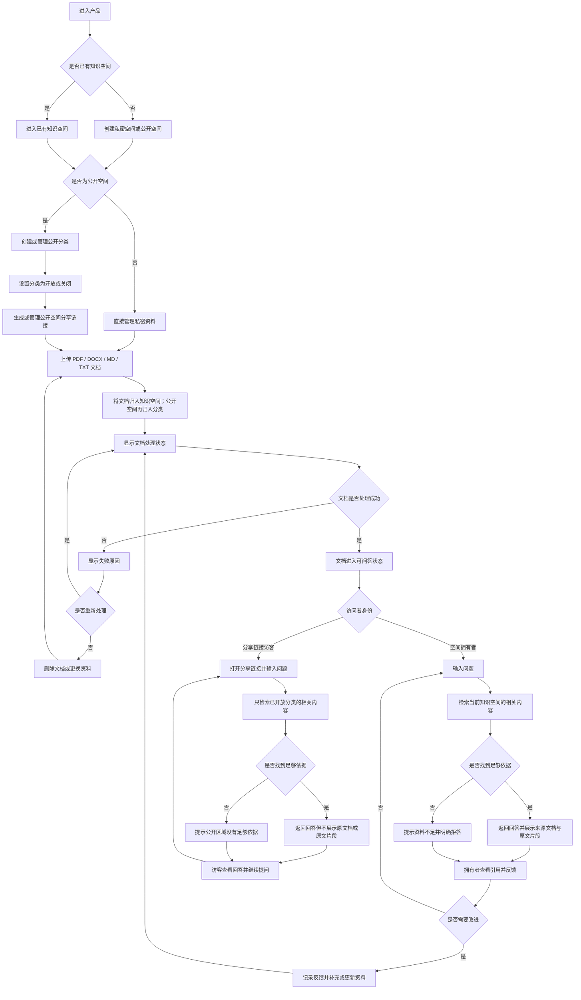

# 企业与个人私有知识库 RAG 产品需求分析文档

> 文档状态：MVP 需求分析稿  
> 研究日期：2026-09-09  
> 目标市场：中国用户  
> 项目定位：个人简历项目，兼容个人与小团队使用  
> 本文范围：需求背景、MVP 功能、后续扩展、用户流程与核对清单  
> 本文不包含：技术选型、系统架构、代码、原型图

## 1. 需求背景

### 1.1 项目背景

个人和企业都积累了大量文档，但知识通常分散在本地文件夹、网盘、聊天记录、项目资料和内部 Wiki 中。用户想查一个问题时，往往需要手动搜索、翻阅多个文件，或者把文档复制到通用 AI 工具中临时提问。

这带来四个核心问题：

1. 查找成本高：资料很多，但定位答案很慢；
2. 知识难复用：同一个问题需要被不同的人重复回答；
3. 回答难验证：通用 AI 可能给出没有来源的确定性答案；
4. 知识难维护：文档过期、版本冲突和无人负责不容易被发现。

私有知识库 RAG 的业务价值，是让用户用自然语言查询自己的资料，并能够看到回答依据；当资料中没有答案时，系统应明确说明，而不是把模型猜测伪装成事实。

### 1.2 市场与业务机会

公开资料对市场有三点支持：

- CNNIC 发布的《生成式人工智能应用发展报告（2025）》显示，截至 2025 年 6 月，中国生成式人工智能用户规模达到 5.15 亿，普及率为 36.5%。这说明用户已经具备使用自然语言与 AI 交互的基础。
- 阿里云研究院基于国内 1500 家企业的调研指出，提升办公效率和生产效率是企业应用 AI 的主要方向，客户服务、业务创新和决策支持也较常见。知识问答、制度查询、产品支持和文档处理都属于容易理解的应用场景。
- 麦肯锡 2025 年调研显示，近三分之二的组织尚未开始跨企业规模化扩展 AI，只有 39% 的受访者报告了企业层面的 EBIT 影响。企业需要的不只是模型演示，还需要能落到具体工作任务、可验证效果的产品。

因此，本项目具备真实业务背景，但不能把机会理解为“只要有 RAG 就有市场”。市场已经从“能不能接入大模型”转向“回答是否可信、知识是否可维护、投入是否值得”。

### 1.3 目标用户

#### 首要用户：个人知识工作者

包括开发者、学生、研究者、产品经理、自由职业者和需要长期整理资料的人。

主要需求：

- 上传课程资料、项目文档、产品手册、论文或个人笔记；
- 快速针对资料提问；
- 查看答案来源和原文片段；
- 资料不足时得到明确提示。

#### 次要用户：小团队成员

包括创业团队、工作室、项目组、客服小组、行政人事团队和研发团队。

主要需求：

- 查询制度、流程、产品信息和常见问题；
- 减少重复咨询和新人培训成本；
- 使用同一套团队资料回答问题；
- 知道资料是否过期、回答来自哪份文件。

#### 后续用户：知识库负责人

包括团队负责人、运营人员、产品经理或内部 IT 管理人员。

主要需求：

- 维护资料和文档负责人；
- 查看高频问题、无答案问题和负面反馈；
- 评估知识库是否真正有效；
- 在扩大使用前控制数据和回答风险。

### 1.4 竞品与可行性判断

目前已经存在覆盖不同层次的成熟产品：

| 竞品类别 | 代表产品 | 已覆盖能力 | 对本项目的影响 |
| --- | --- | --- | --- |
| AI 应用开发平台 | [Dify](https://docs.dify.ai/guides/knowledge-base/retrieval)、[FastGPT](https://doc.tryfastgpt.ai/docs/guide/knowledge_base/) | 知识库、工作流、智能体、应用发布、API 和多种数据来源 | “上传文档后聊天”已经是基础能力，不能作为主要卖点。 |
| 企业级私有知识平台 | [RAGFlow](https://ragflow.net/docs)、[MaxKB](https://maxkb.cn/docs/v2/index.html) | 复杂文档理解、引用、私有化部署、企业应用和智能体 | 企业级能力空间很大，但第一版不适合做大而全。 |
| 个人与团队知识工具 | [AnythingLLM](https://anythingllm.com/cloud) | 个人本地使用、团队空间、RAG、权限和云端套餐 | 个人到小团队的产品路径成立，但仍需要中文体验、可信回答和知识维护差异化。 |
| 云厂商托管服务 | [阿里云百炼知识库](https://help.aliyun.com/zh/model-studio/user-guide/rag-knowledge-base/)、[腾讯云智能体开发平台](https://cloud.tencent.cn/document/product/1759/132546) | 托管式 RAG、模型生态、API、标签和企业级接入 | 基础设施门槛正在降低，独立产品更应聚焦具体体验和业务结果。 |

竞品公开页面显示，行业已经普遍提供文档导入、检索、问答、引用、权限、工作流或云端套餐。由此可得：

- 做一个通用平台，竞争力较弱；
- 做一个“可信回答 + 反馈改进 + 轻量评测”的知识工作台，更适合作为个人项目；
- 做一个个人和小团队都能理解的最小闭环，比直接模拟大型企业软件更可控。

### 1.5 项目定位

暂定产品定位：

> 面向个人和小团队的可信知识工作台：把分散文档转化为可追溯的问答结果；用户可以将资料保留在私密空间，也可以按分类开放公开空间，让访客通过链接提问但无法查看原文档；回答没有证据时明确说明不知道，并通过反馈和测试题持续改进知识库。

### 1.6 MVP 的范围假设

- 第一版同时支持私密空间和公开空间；
- 公开空间内部可以按主题划分区域，例如“个人工作经历”“项目经验”“产品介绍”等；
- 用户可以只开放公开空间中的特定区域，并通过分享链接让访客访问；
- 访客只能围绕已开放区域提问，不能查看原文档、原文片段、文件下载入口或私密空间；
- 用一套模拟企业资料展示小团队场景，但不在第一版实现完整团队协作；
- 先支持常见文本型文档，表格、图片、网页同步和多模态放到后续；
- 第一版只服务低风险的资料查询、产品说明、制度 FAQ、项目文档和个人学习资料；
- 不对医疗、法律、金融投资等高风险决策场景作可靠性承诺；
- Stripe、完整订阅体系和企业采购流程不属于 MVP。

## 2. MVP 最小可行功能点

### 2.1 MVP 目标

用一条完整、可演示、可验证的用户闭环证明产品价值：

> 用户创建私密或公开知识空间 → 对公开空间建立分类 → 选择特定分类并生成分享链接 → 上传资料 → 访客围绕已开放分类提问 → 系统返回不暴露原文档的回答 → 资料不足时拒答。

空间拥有者可以查看来源并维护资料；访客只能提问和查看回答。第一版不加入复杂智能体、工作流、多模态、第三方平台连接和完整企业治理。

### 2.2 P0 核心功能

#### 功能一：私密空间、公开空间与分类

用户可以创建两类知识空间：私密空间和公开空间。公开空间内部可以按主题划分多个分类，并对分类单独设置是否开放。

最小要求：

- 创建私密空间或公开空间；
- 编辑名称和描述；
- 公开空间可以创建多个分类，例如个人工作经历、项目经验、产品说明；
- 每个公开分类都可以独立设置为开放或关闭；
- 公开空间默认不自动暴露，必须由用户主动生成分享链接；
- 用户可以生成、复制和撤销公开空间分享链接；
- 切换或删除知识空间；
- 私密空间只允许空间拥有者访问；
- 公开空间中的关闭分类和私密空间不会被访客检索。

#### 功能二：文档上传与管理

用户可以上传常见文档，并查看每份文档的状态。

第一版建议只支持：PDF、DOCX、Markdown、TXT。

最小要求：

- 上传单个或多个文档；
- 将文档归入指定知识空间和分类；
- 展示文件名、大小、上传时间和处理状态；
- 状态至少包括：处理中、可用、失败；
- 处理失败时展示原因，并允许重新处理；
- 删除文档后，文档内容不能继续参与问答；
- 能够查看文档基本信息；
- 只有空间拥有者能够查看和管理原文档。

#### 功能三：知识库问答与访客模式

空间拥有者可以围绕当前知识空间提问；访客通过分享链接进入公开空间后，只能围绕已开放分类提问。

最小要求：

- 支持空间拥有者进行单轮和连续对话；
- 支持访客通过分享链接进入提问页面；
- 访客问题只检索公开空间中已开放的分类；
- 私密空间、关闭分类和未授权资料不会参与访客问答；
- 空间拥有者看到回答来源、原文片段和来源位置；
- 访客只能看到回答内容，不展示原文档、文件名、原文片段、页码、下载入口或原文链接；
- 访客页面明确提示当前回答仅基于已开放区域；
- 文档尚未处理完成时，禁止误导用户认为它已进入知识库。

#### 功能四：无依据拒答与范围控制

当当前访问范围内没有足够依据时，系统应明确说明资料不足。公开空间访客的问题不能通过私密资料或关闭分类“补充回答”。

最小要求：

- 不把没有来源的内容包装成企业或个人资料中的事实；
- 对资料中没有覆盖的问题给出明确提示；
- 对访客超出已开放分类的问题给出范围提示；
- 对资料互相矛盾的情况进行提醒；
- 拒答结果也应被记录，方便后续改进。

#### 功能五：回答反馈

空间拥有者可以对回答做简单反馈；是否开放访客反馈由空间拥有者控制，第一版可以默认关闭访客反馈。

最小要求：

- 有用；
- 无用；
- 需要修正；
- 可选填写原因：答非所问、来源不匹配、信息过期、回答不完整、资料缺失；
- 访客反馈不能暴露私密资料或原文档内容。

#### 功能六：轻量质量自测

为了体现项目的业务和技术能力，第一版增加一个简单的测试区，但不做复杂的自动评测平台。测试区由空间拥有者使用，可以分别验证私密空间和公开分类的回答边界。

最小要求：

- 手动录入 10—20 个典型问题；
- 标记问题属于私密空间、公开分类或跨范围问题；
- 对每个问题查看回答和引用来源；
- 人工标记正确、部分正确或错误；
- 汇总正确率、带有效来源的回答数、无答案问题数和越权回答数；
- 可以根据测试结果回到文档或问题反馈中进行改进。

评测指标可以参考 Ragas 的 Context Precision、Context Recall、Faithfulness 和 Response Relevancy，但 MVP 只需要让结果清晰、可复现、能支持改进，不需要追求复杂指标体系。[Ragas 指标说明](https://docs.ragas.io/en/stable/concepts/metrics/available_metrics/)

#### 功能七：基础记录与数据控制

最小要求：

- 记录文档处理状态；
- 记录问答历史；
- 记录用户反馈；
- 支持删除知识空间和文档；
- 支持撤销公开分享链接；
- 在产品中说明资料的用途、保存范围和删除方式；
- 不把“私有知识库”宣传成已经满足所有企业合规要求。

### 2.3 MVP 非目标

以下内容明确不进入第一版：

- 多组织、多租户和复杂权限体系；
- 完整的企业 SSO、审计和审批流；
- 工作流、智能体和自动执行任务；
- 图片、音频、视频、扫描件和复杂表格的全面处理；
- 飞书、钉钉、企业微信、Notion、网盘等第三方同步；
- 对外开放 API 和嵌入式发布；
- 私有化交付方案；
- 计费、优惠券、发票、Stripe 支付；
- 医疗、法律、金融等高风险领域的专业承诺。

### 2.4 MVP 验收标准

第一版完成的判断标准：

1. 用户能在 5 分钟内创建知识空间并上传一份资料；
2. 用户能创建私密空间和公开空间，并为公开空间创建分类；
3. 用户能只开放公开空间中的指定分类，并生成分享链接；
4. 访客通过链接能够进入提问页面，但不能查看原文档或原文片段；
5. 访客问题只会基于已开放分类回答，不会触及私密空间和关闭分类；
6. 用户能看见文档从上传到可用的状态变化；
7. 空间拥有者可以针对资料提问并获得带来源的回答；
8. 对当前访问范围没有覆盖的问题，系统能够明确拒答或提示资料不足；
9. 用户可以提交反馈，并在记录中看到反馈内容；
10. 能用 10—20 个测试问题完成一次人工质量检查；
11. 删除文档后，该文档不会继续出现在新的回答依据中；
12. 用户可以撤销公开分享链接；
13. 能用一套“个人工作经历”或模拟企业资料完整演示产品价值；
14. 不需要额外解释技术细节，面试官也能理解产品解决的业务问题。

## 3. 后续可以做的扩展功能点

### 3.1 优先级说明

- P1：MVP 验证成功后优先做，直接提升留存和小团队使用价值；
- P2：已有稳定用户或明确反馈后再做，提升产品深度和商业化能力；
- P3：企业客户、规模化部署或收入验证后再做，避免过早复杂化。

### 3.2 P1：小团队协作与知识维护

#### P1-1 公开空间增强

- 分享链接有效期；
- 分享链接访问密码；
- 限制访客提问次数；
- 查看访客提问记录；
- 关闭或重新生成分享链接；
- 设置公开分类的展示名称和说明；
- 公开分类的排序和默认入口。

价值：在不暴露原文档的前提下，提高个人经历展示、作品集介绍和公开知识问答的可控性。

#### P1-2 团队知识空间

- 邀请成员加入知识空间；
- 区分负责人、编辑者和普通使用者；
- 限制不同成员的查看、编辑和删除权限；
- 保障不同团队知识空间之间的数据隔离。

价值：让项目从个人工具升级为可演示的小团队产品。

#### P1-3 文档生命周期

- 文档负责人；
- 生效时间和有效期；
- 文档版本；
- 启用、停用和过期状态；
- 文档更新提醒。

价值：解决“文档上传后无人维护”的真实业务问题。

#### P1-4 问题与反馈中心

- 汇总无答案问题；
- 汇总负面反馈；
- 按问题类型筛选；
- 将问题标记为待补充、已修复或暂不处理；
- 记录修复前后的回答变化。

价值：形成知识运营闭环，而不是停留在聊天功能。

#### P1-5 更清晰的知识组织

- 知识库标签；
- 产品、制度、项目、FAQ 等主题分类；
- 按知识主题选择回答范围；
- 文档和知识空间搜索。

价值：提高不同主题资料混合时的可控性。

#### P1-6 基础套餐权益

- 个人免费版；
- 个人专业版；
- 小团队版；
- 按成员数、文档数或使用额度限制权益；
- 展示用量和剩余额度。

价值：为未来商业化做业务验证，但不急于接入具体支付渠道。

### 3.3 P2：数据连接与产品深度

#### P2-1 更多知识来源

- 网页或网站同步；
- Markdown 仓库同步；
- 企业网盘或知识平台同步；
- FAQ 表格导入；
- 文档批量导入与批量更新。

#### P2-2 多模态与复杂文档

- 图片和扫描文档；
- 表格和图表；
- 演示文稿；
- 图片、表格和文本的联合引用；
- 文档结构预览和人工修正。

#### P2-3 质量评测增强

- 测试集版本管理；
- 不同知识库版本对比；
- 自动生成测试问题；
- 检索相关性、回答忠实度和完整性趋势；
- 失败样例分析。

#### P2-4 公开空间与对外使用增强

- 公开空间访问统计；
- 访客问题审核或隐藏；
- 限制访问地区、域名或来源；
- 嵌入到已有业务页面；
- 开放查询接口；
- 对话记录和调用数据统计。

### 3.4 P3：企业级能力与商业化深化

#### P3-1 企业治理

- 单点登录；
- 更细粒度的角色与数据权限；
- 操作审计；
- 数据导出、备份和恢复；
- 企业级保留策略和删除策略。

#### P3-2 私有化与行业版本

- 企业内部部署；
- 行业知识模板；
- 行业术语和规则管理；
- 高风险场景的人工审核；
- 企业安全与合规评估。

#### P3-3 智能体与业务流程

- 工作流编排；
- 多步骤任务；
- 工具调用；
- 工单、CRM 或内部系统联动；
- 从“回答问题”升级到“辅助完成任务”。

#### P3-4 支付与订阅

- 订阅管理；
- 试用期和套餐升级；
- 支付成功、退款和续费状态；
- 面向海外用户再评估 Stripe；
- 面向中国大陆用户单独评估本地支付和开票要求。

Stripe 官方全球可用地区列表包含香港特别行政区，但不等同于中国大陆主体可以直接开通；后续需要结合经营主体、收款地区、目标用户和支付习惯重新核验。[Stripe 全球可用地区](https://stripe.com/global)

## 4. 用户操作的具体流程图

以下流程覆盖 MVP 的核心闭环，包括空间可见性、分类开放和访客提问；不包含后续团队治理、支付和复杂扩展。

## 5. 需求功能核对清单

### 5.1 MVP 范围核对

- [ ] 已明确产品面向个人和小团队，而不是一开始面向所有企业。
- [ ] 已明确 MVP 只验证一个核心闭环：空间与分类、上传资料、问答、引用、拒答、反馈。
- [ ] 已明确私密空间和公开空间的访问边界。
- [ ] 已明确访客只能提问，不能查看原文档。
- [ ] 已明确第一版不包含复杂技术平台能力、支付和完整企业治理。
- [ ] 已准备一套可用于演示的模拟企业资料。
- [ ] 已准备 10—20 个典型测试问题。

### 5.2 知识空间

- [ ] 用户可以创建私密空间。
- [ ] 用户可以创建公开空间。
- [ ] 用户可以查看知识空间名称、描述和资料数量。
- [ ] 公开空间可以创建多个分类。
- [ ] 分类可以使用“个人工作经历”“项目经验”“产品说明”等主题名称。
- [ ] 每个公开分类都可以独立设置为开放或关闭。
- [ ] 公开空间默认不自动暴露。
- [ ] 用户可以生成公开空间分享链接。
- [ ] 用户可以复制分享链接。
- [ ] 用户可以撤销公开空间分享链接。
- [ ] 撤销链接后，访客无法继续访问公开空间。
- [ ] 私密空间只允许空间拥有者访问。
- [ ] 关闭分类不会参与访客问答。
- [ ] 用户可以删除知识空间。
- [ ] 不同知识空间之间不会混用资料。

### 5.3 文档管理

- [ ] 支持上传 PDF 文档。
- [ ] 支持上传 DOCX 文档。
- [ ] 支持上传 Markdown 文档。
- [ ] 支持上传 TXT 文档。
- [ ] 文档可以归入指定知识空间和分类。
- [ ] 可以查看文档名称、大小和上传时间。
- [ ] 可以查看处理中、可用和失败状态。
- [ ] 处理失败时可以看到原因。
- [ ] 处理失败时可以重新处理。
- [ ] 用户可以删除文档。
- [ ] 删除后的文档不会继续参与新的问答。
- [ ] 文档尚未处理完成时不会被误认为已可用。

### 5.4 问答与可信度

- [ ] 用户可以输入问题。
- [ ] 支持连续追问。
- [ ] 回答围绕当前知识空间生成。
- [ ] 空间拥有者的回答展示引用文档名称。
- [ ] 空间拥有者可以查看相关原文片段和来源位置。
- [ ] 访客可以通过分享链接进入提问页面。
- [ ] 访客问题只检索公开空间中的已开放分类。
- [ ] 访客看不到原文档。
- [ ] 访客看不到文件名、原文片段、页码、下载入口和原文链接。
- [ ] 访客看不到私密空间和关闭分类的内容。
- [ ] 访客只能看到回答并继续提问。
- [ ] 资料不足时会明确提示。
- [ ] 访客超出已开放分类时会得到范围提示。
- [ ] 系统不会把无来源猜测包装成确定事实。
- [ ] 资料存在冲突时会提醒用户。

### 5.5 反馈与评测

- [ ] 用户可以标记回答有用。
- [ ] 用户可以标记回答无用。
- [ ] 用户可以标记需要修正。
- [ ] 用户可以选择反馈原因。
- [ ] 访客反馈默认关闭或由空间拥有者控制。
- [ ] 访客反馈不会暴露私密资料或原文档内容。
- [ ] 系统会记录无答案问题。
- [ ] 用户可以手动维护测试问题。
- [ ] 测试问题可以区分私密空间、公开分类和跨范围问题。
- [ ] 可以查看测试问题对应的回答和引用。
- [ ] 可以人工标记正确、部分正确或错误。
- [ ] 可以统计正确回答、有效引用、无答案问题和越权回答。

### 5.6 数据控制与产品边界

- [ ] 产品说明资料的用途和保存范围。
- [ ] 用户可以删除自己的资料。
- [ ] 用户可以删除问答记录或知识空间。
- [ ] 公开空间的访客无法直接查看原文档。
- [ ] 公开空间的访客无法通过问题绕过分类限制。
- [ ] 不宣称 MVP 已满足全部企业合规要求。
- [ ] 不将医疗、法律、金融等高风险场景作为默认演示场景。
- [ ] 未在 MVP 中加入 Stripe 和复杂订阅流程。

### 5.7 MVP 验证

- [ ] 至少邀请 5 名目标用户体验。
- [ ] 至少 3 名用户在首次体验后再次使用。
- [ ] 至少 80% 的测试用户可以独立完成上传、提问和查看来源。
- [ ] 用户能够说清楚产品解决了什么问题。
- [ ] 能够展示一个回答正确的案例。
- [ ] 能够展示一个带来源的案例。
- [ ] 能够展示一个公开分类通过链接被访问的案例。
- [ ] 能够展示访客只能看到回答、不能看到原文档的案例。
- [ ] 能够展示访客提问不会触及私密空间和关闭分类的案例。
- [ ] 能够展示一个资料不足时拒答的案例。
- [ ] 能够展示一个错误反馈推动资料改进的案例。
- [ ] 能够记录一次完整的质量自测结果。
- [ ] 能够根据用户反馈决定下一项 P1 功能。

## 6. 最终判断

项目适合作为简历项目，前提是把重点从“我使用了 RAG”转为“我识别了企业知识问答的业务问题，并设计了可验证的产品闭环”。

第一版的核心不应是功能数量，而应是以下四个事实能够被演示出来：

1. 用户能把自己的资料变成可查询的私密或公开知识空间；
2. 用户能按分类选择性开放内容，并通过链接让访客提问；
3. 访客只能获得回答，不能看到原文档，也不能绕过分类限制；
4. 空间拥有者的回答能够展示来源，资料不足时能够拒答；
5. 用户反馈能够沉淀成待改进问题；
6. 产品能够用测试问题证明效果，而不是只凭主观感受。

如果 MVP 能完成上述闭环，后续再扩展团队协作、知识生命周期、数据连接、企业治理和支付，项目就具备从学习实践到业务产品的连续成长路径。

### 研究依据

- [CNNIC《生成式人工智能应用发展报告（2025）》](https://www.cnnic.net/n4/2025/1021/c88-11391.html)
- [阿里云《中国人工智能应用发展报告（2025）》](https://i.cgeinc.com/assets/uploads/2025/07/%E9%98%BF%E9%87%8C%E4%BA%91%E4%B8%AD%E5%9B%BD%E4%BA%BA%E5%B7%A5%E6%99%BA%E8%83%BD%E5%BA%94%E7%94%A8%E5%8F%91%E5%B1%95%E6%8A%A5%E5%91%8A.pdf)
- [McKinsey《The state of AI in 2025》](https://www.mckinsey.com/capabilities/quantumblack/our-insights/the-state-of-ai)
- [Deloitte《企业生成式人工智能应用现状》相关介绍](https://www.deloitte.com/cn/zh/about/recognition/news/deloitte-wef-2024-state-of-generative-ai.html)
- [《生成式人工智能服务管理暂行办法》](https://www.cac.gov.cn/2023-07/13/c_1690898327029107.htm)
- [《中华人民共和国个人信息保护法》](https://www.npc.gov.cn/npc/c2/c30834/202108/t20210820_313088.html)
- [《中华人民共和国数据安全法》](https://www.npc.gov.cn/npc/c2/c30834/202106/t20210610_311888.html)
